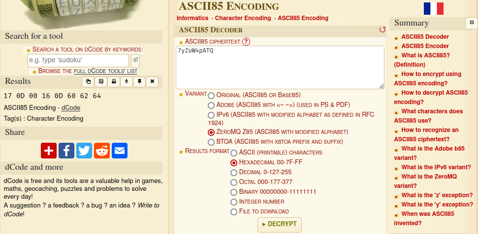
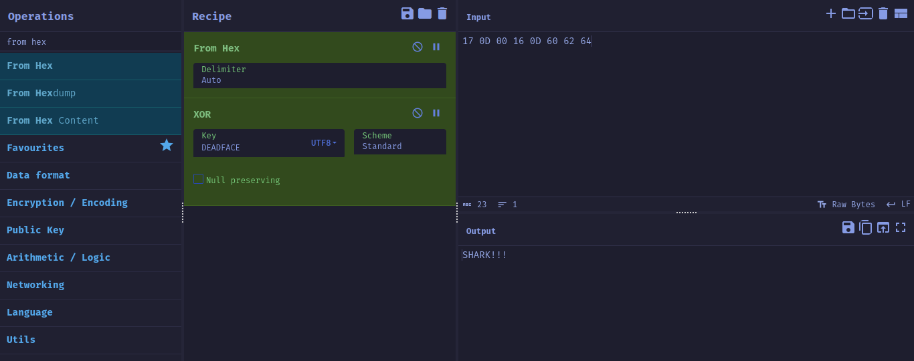
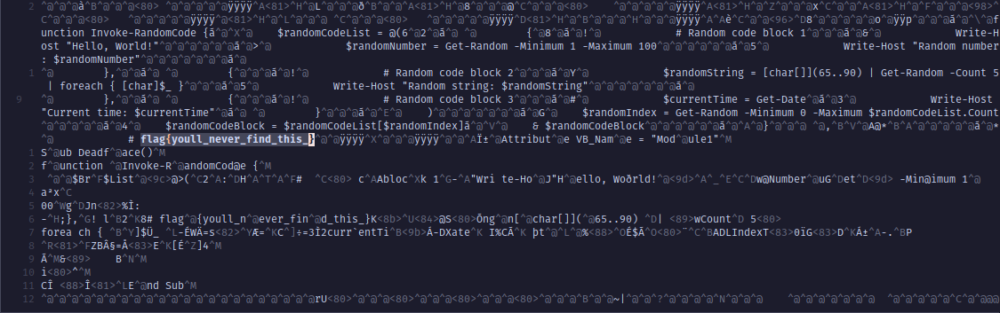

# Scoreboard


# Cereal Killer 01

## Description

> Points: 50
>
> Created by: `TheZeal0t`

How well do you know your DEADFACE hackers? Test your trivia knowledge of our beloved friends at our favorite hactivist collective! We’ll start with bumpyhassan. Even though he grates on TheZeal0t a bit, we find him to be absolutely ADORKABLE!!!

Choose one of the binaries below to test your BH trivia knowlege.

Enter the flag in the format: flag{Ch33ri0z_R_his_FAV}.

[Download file](./rev/cereal_killer_1/cereal)

## Solution

When the binary is run, it asks for bumpyhassan's favorite breakfast cereal.

```sh
deadface/rev/cereal1 on  master [?] via 🐍 v3.11.5
❯ ./cereal
Bumpyhassan loves Halloween, so naturally, he LOVES SPOOKY CEREALS!
He also happens to be a fan of horror movies from the 1970's to the 1990's.
What is bumpyhassan's favorite breakfast cereal? adsf
Sorry, that is not bumpyhassan's favorite cereal. :(
```

The following code (after some cleanup) snippets are the interesting parts from looking at it in ghidra.

```c
  p_flag = "I&_9a%mx_tRmE4D3DmYw_9fbo6rd_aFcRbE,D.D>Y[!]!\'!q";
  puts("Bumpyhassan loves Halloween, so naturally, he LOVES SPOOKY CEREALS!");
  puts("He also happens to be a fan of horror movies from the 1970\'s to the 1990\'s.");
  printf("What is bumpyhassan\'s favorite breakfast cereal? ");
  fgets(bf,0xfff,_stdin);
  for (p_bf = bf; *p_bf != '\0'; p_bf = p_bf + 1) {
    *p_bf = *p_bf + '\a';
  }
  *p_bf = '\0';
  check = memcmp(&DAT_00012039,bf,14);
  if (check == 0) {
    puts("You are correct!");
    i = flag;
    for (; *p_flag != '\0'; p_flag = p_flag + 2) {
      *i = *p_flag;
      i = i + 1;
    }
    *i = '\0';
    printf("flag{%s}\n",flag);
  }
  else {
    puts("Sorry, that is not bumpyhassan\'s favorite cereal. :( ");
  }
```

It can be easily seen that the flag is built on the stack and printed after the password check is done and our input does not get in the way of our flag being decrypted. That is, we can jump to the code block inside the `if` check and get the flag decrypted and stored in the stack and even print it. We can also zero out the `eax` register inside the debugger after the `memcmp` function is called to have a correct execution and not get any segfault that might arise by directly jumping to the address or if the address is hard to find. I will use this technique whenever I can because it makes reversing with a particular goal in mind easier and it works most of the time without any hiss.

```sh
[ Legend: Modified register | Code | Heap | Stack | String ]
────────────────────────────────────────────────────────────────────────────────────────────────── registers ────
$eax   : 0xffffffff
$ebx   : 0x56558fc4  →  <_GLOBAL_OFFSET_TABLE_+0> int3
$ecx   : 0x707c794d ("My|p"?)
$edx   : 0xffffbd5a  →  0x00000000
$esp   : 0xffffbcd0  →  0xffffbd58  →  0x00000000
$ebp   : 0xffffcd58  →  0x00000000
$esi   : 0xffffce2c  →  0xffffd044  →  "XDG_GREETER_DATA_DIR=/var/lib/lightdm-data/groot"
$edi   : 0xf7ffcb80  →  0x00000000
$eip   : 0x565562e9  →  <main+268> test eax, eax
$eflags: [zero carry parity adjust SIGN trap INTERRUPT direction overflow resume virtualx86 identification]
$cs: 0x23 $ss: 0x2b $ds: 0x2b $es: 0x2b $fs: 0x00 $gs: 0x63
────────────────────────────────────────────────────────────────────────────────────────────────────── stack ────
0xffffbcd0│+0x0000: 0xffffbd58  →  0x00000000	 ← $esp
0xffffbcd4│+0x0004: 0x00000000
0xffffbcd8│+0x0008: 0x00000000
0xffffbcdc│+0x000c: 0x56557008  →  "I&_9a%mx_tRmE4D3DmYw_9fbo6rd_aFcRbE,D.D>Y[!]!'!q"
0xffffbce0│+0x0010: 0x56557039  →   dec ebp
0xffffbce4│+0x0014: 0x00000000
0xffffbce8│+0x0018: 0x00000000
0xffffbcec│+0x001c: 0x00000000
──────────────────────────────────────────────────────────────────────────────────────────────── code:x86:32 ────
   0x565562db <main+254>       push   DWORD PTR [ebp-0x1078]
   0x565562e1 <main+260>       call   0x56556070 <memcmp@plt>
   0x565562e6 <main+265>       add    esp, 0x10
●→ 0x565562e9 <main+268>       test   eax, eax
   0x565562eb <main+270>       jne    0x56556369 <main+396>
   0x565562ed <main+272>       sub    esp, 0xc
   0x565562f0 <main+275>       lea    eax, [ebx-0x1eba]
   0x565562f6 <main+281>       push   eax
   0x565562f7 <main+282>       call   0x56556090 <puts@plt>
──────────────────────────────────────────────────────────────────────────────────────────────────── threads ────
[#0] Id 1, Name: "cereal", stopped 0x565562e9 in main (), reason: BREAKPOINT
────────────────────────────────────────────────────────────────────────────────────────────────────── trace ────
[#0] 0x565562e9 → main()
─────────────────────────────────────────────────────────────────────────────────────────────────────────────────
gef➤  set $eax=0
gef➤  c
Continuing.
You are correct!
flag{I_am_REDDY_for_FREDDY!!!}
[Inferior 1 (process 8224) exited normally]
```

flag: `flag{I_am_REDDY_for_FREDDY!!!}`

> Note: Here's the [code](./rev/cereal_killer_1/sol.py) for reversing and getting the favourite cereal name correct.

---


# Cereal Killer 02

## Description

> Points: 100
>
> Created by: `TheZeal0t`

luciafer can be a bit of trouble sometimes, but she can put away the sugary monster cereals with the best of them! She has a favorite, too, and it is based on her favorite monster. See if you can figure it out! Select the binary for your preferred platform.

[Download file](./rev/cereal_killer_2/cereal)

## Solution

when the binary is run, it asks for Luciafer's favorite breakfast cereal.

```sh
deadface/rev/cereal_killer_2 on  master [?]
❯ ./cereal
Luciafer also loves Halloween, so she, too, LOVES SPOOKY CEREALS!
She has different favorite villain from 70-80's horror movies.
What is Luciafer's favorite breakfast cereal? adfsda
INCORRECT....: I'm afraid that is not Lucia's current favorite monster cereal.  She is kind of capricious, you know, so it changes often.
```

The following code (after some cleanup) snippets are the interesting parts from looking at it in ghidra.

```c
  puts("Luciafer also loves Halloween, so she, too, LOVES SPOOKY CEREALS!");
  puts("She has different favorite villain from 70-80\'s horror movies.");
  printf("What is Luciafer\'s favorite breakfast cereal? ");
  fgets(input,0xfff,_stdin);
  decode_str(input,63,
             "\b=3?\x1562GR\x12\x1bekHA\v<\x14\x01\x1d4A[)\x1b\x13L&\x024+\x16\x06@\x17\r8_\"\x02=\x 1c\bK5\\Hi\x0f\x13L/1\x11K-\x1aWIejS\x1c"
             ,correct);
  iVar1 = strncmp(correct,"CORRECT!!!!!",12);
  if (iVar1 == 0) {
    puts(correct);
  }
  else {
    printf("%s",
           "INCORRECT....: I\'m afraid that is not Lucia\'s current favorite monster cereal.  She is  kind of capricious, you know, so it changes often.\n"
          );
  }
```

```c
void decode_str(char *input,int len,char *flag,char *correct)

{
  int mod;
  int i;

  mod = 0;
  i = 0;
  while (i < len) {
    correct[i] = flag[i] ^ input[mod];
    i += 1;
    mod += 1;
    if (11 < mod) {
      mod = 0;
    }
  }
  correct[i] = '\0';
  return;
}
```

After analyzing the `decode_str` function, we can see that we cannot use the trick we used in [cereal killer 1](./index.md#Cereal-Killer-01) to bypass the check but we can do something pretty interesting instead. The `decode_str` takes our input and uses it as a key for rotating xor cipher to decode the flag string that has been encoded by the original key. And we can see that the first 12 characters are later compared in the main function with the string `CORRECT!!!!!`. Now, if we input our favourite cereal as `CORRECT!!!!!`, we sould get a string comparison with our cereal and `CORRECT!!!!!` in the main function.

```sh
[ Legend: Modified register | Code | Heap | Stack | String ]
───────────────────────────────────────────────────────────────────────────────────────────────────────────────────────────────────────────────────────── registers ────
$eax   : 0xffffbc2c  →  0x6d61724b ("Kram"?)
$ebx   : 0x56558ff4  →  <_GLOBAL_OFFSET_TABLE_+0> call 0x86559037
$ecx   : 0x4e
$edx   : 0x3f
$esp   : 0xffffac10  →  0xffffbc2c  →  0x6d61724b ("Kram"?)
$ebp   : 0xffffcc38  →  0x00000000
$esi   : 0xffffcd0c  →  0xffffcf45  →  "VIMRUNTIME=/usr/share/nvim/runtime"
$edi   : 0xf7ffcb80  →  0x00000000
$eip   : 0x56556301  →  <main+202> call 0x56556080 <strncmp@plt>
$eflags: [zero carry parity ADJUST SIGN trap INTERRUPT direction overflow resume virtualx86 identification]
$cs: 0x23 $ss: 0x2b $ds: 0x2b $es: 0x2b $fs: 0x00 $gs: 0x63
───────────────────────────────────────────────────────────────────────────────────────────────────────────────────────────────────────────────────────────── stack ────
0xffffac10│+0x0000: 0xffffbc2c  →  0x6d61724b    ← $esp
0xffffac14│+0x0004: 0x56557187  →  "CORRECT!!!!!"
0xffffac18│+0x0008: 0x00000c ("
                               "?)
0xffffac1c│+0x000c: 0xffffbc2c  →  0x6d61724b
0xffffac20│+0x0010: 0x56557008  →  "INCORRECT....: I'm afraid that is not Lucia's curr[...]"
0xffffac24│+0x0014: 0x56557094  →   or BYTE PTR ds:0x36153f33, bh
0xffffac28│+0x0018: 0x00000000
0xffffac2c│+0x001c: "CORRECT!!!!!\n"
─────────────────────────────────────────────────────────────────────────────────────────────────────────────────────────────────────────────────────── code:x86:32 ────
   0x565562f9 <main+194>       push   eax
   0x565562fa <main+195>       lea    eax, [ebp-0x100c]
   0x56556300 <main+201>       push   eax
 → 0x56556301 <main+202>       call   0x56556080 <strncmp@plt>
   ↳  0x56556080 <strncmp@plt+0>  jmp    DWORD PTR [ebx+0x1c]
      0x56556086 <strncmp@plt+6>  push   0x20
      0x5655608b <strncmp@plt+11> jmp    0x56556030
      0x56556090 <_start+0>       endbr32
      0x56556094 <_start+4>       xor    ebp, ebp
      0x56556096 <_start+6>       pop    esi
─────────────────────────────────────────────────────────────────────────────────────────────────────────────────────────────────────────────── arguments (guessed) ────
strncmp@plt (
   [sp + 0x0] = 0xffffbc2c → 0x6d61724b,
   [sp + 0x4] = 0x56557187 → "CORRECT!!!!!"
)
─────────────────────────────────────────────────────────────────────────────────────────────────────────────────────────────────────────────────────────── threads ────
[#0] Id 1, Name: "cereal", stopped 0x56556301 in main (), reason: BREAKPOINT
───────────────────────────────────────────────────────────────────────────────────────────────────────────────────────────────────────────────────────────── trace ────
[#0] 0x56556301 → main()
────────────────────────────────────────────────────────────────────────────────────────────────────────────────────────────────────────────────────────────────────────
gef➤  x/s 0xffffbc2c
0xffffbc2c:     "KramPuffs3:D(\a\023YyWU<\025`z\bX\\\036tGw\1777'a6,{\020pPx_\\j\024}iHL\\\036}tR\037\f;vhD)\034N"
gef➤
```

```sh
deadface/rev/cereal_killer_2 on  master
❯ ./cereal
Luciafer also loves Halloween, so she, too, LOVES SPOOKY CEREALS!
She has different favorite villain from 70-80's horror movies.
What is Luciafer's favorite breakfast cereal? KramPuffs3:D
CORRECT!!!!! : flag{GramPa-KRAMpus-Is-Comin-For-Da-Bad-Kids!!!}
```

flag: `flag{GramPa-KRAMpus-Is-Comin-For-Da-Bad-Kids!!!}`

---


# Cereal Killer 04

## Description

> Points: 200
>
> Created by: `TheZeal0t`

lilith is not too old to have a favorite monster / ghoul / daemon / phantasm / poltergeist / creature / extraterrestrial or a favorite sugary breakfast cereal! She also has a favorite programming language (which no one else at DEADFACE likes that much, and they all think she is kinda weird for it). She probably mainly likes it because it was her first language she learned at the age of 9.

See if you can crack her program and figure out what her favorite cereal and entity are.

Enter the answer as flag{LilithLikesMonsterCereal}.

[Download file](./rev/cereal_killer_4/cereal.jar)

## Solution

When the jar file is run, it asks for a password.

```sh
deadface/rev/cereal_killer_4 on  master [!?] via ☕ v21
❯ java -jar cereal.jar
lilith's favorite cereal is also her favorite monster / ghoul / daemon / phantasm / poltergeist / creature / extraterrestrial.
To get both answers (and the flag), enter her entity (with special characters) as a password: asdfasf
Sorry, that is not the correct monster / cereal / password.  Please try again.
```

The jar file is easily decompiled with procyon-decompiler.

```sh
deadface/rev/cereal_killer_4 on  master [!?] via ☕ v21 took 2s
❯ procyon-decompiler cereal.jar > cereal.java
```

Here's the [decompiled](./rev/cereal_killer_4/cereal.java) java file.

The following code snippets are the interesting parts:

```java
class CenoBytes
{
    public static void main(final String[] args) {
        final byte[] kitbal = "b7&q76n=gW3>RT?YXJcPb7*05YXJcPb7*05YXN?K3}_w=6n=hw3>RT?YXJcPb7*056n+5#b7*05YXN?K3}#_+YXJcPb7*05YXJcPb7*f36n+5#b7*05YXJd%3>O{^6n=hweHR{bYXJcPb7*05YXJcPb7*05YkqzKb7*05Ykq!y3>RT?YXJcPb7*05YXJcPb7)}=6afJb3>RT?YXJcP3>O}9Yb$;Za~B>B6ny~!FK8YO6n=gIb7*056n=hwb7*0GYYqVc4;LN{6n+5#4`^X>6n=hw3}<0-H+}&D3>O{^7k&X<3>RT?Ykq!y3>O{^6n=hwFKA(MHvxWr3>O{^WB~yI3>O{^6b@Yhb2J_eYkq!y3>RSy6n=hw3>Q6eYh3|;3}|k0YXJcP4`^X>6n=hwb7)}=6n=hwd}v`V6kP!UFBcwiYXJd$a};4%7XbkQ3>O_PYXMyW4;LPCYkdI$b7x@<6n=dHa};3?YXJccb7)~MYXJd$3};~t6n=dHb7&q77Y+dd3}_uLYkqzK4;OB76n+7H3}|5u6ajq!b7(z%YXN?K3}+n;6n=hwb7&oMHvs`%b7&n76n+5#4-_79YkqzK4`^X7WC0Eib7&oMWB~zvb7x_46ajq!d}v{EYkdI$a~B>CYXMyWa};56YYqVpb3$P*YXMyWb2MRcH-3H&a~B?R7k&-_d>3wVYaam}b97;HWB~yIb2MRcYXN-$a}*v86kP!UFKB6UYaM<cb75f)6nz1Gb7&q76b@Yhb2MQNWB~yIFBBdP6ajq!d}v{EYXJcPa}+&tYXNuxa};iJ6n+7HFKA&dYkdv@b7*01WB~yIa}i;3YXJ!Xb95eTYX|`Wb2MRc7XblXb2MRcYj^<x4`^X*YaanCb2J_eHvs`%3>O{^V}5>q3}|6}7k++zb7*dIYYqVpb7&n66n=hw3>RT?WPN^q3}|6&6n<R+a}*v86n+j}3>O}9YYu&W3>RT?b$)(bb7(yc6n+kV3>O}9Yaf1o3>O{^6afJaFBcvSHvs_&3>O{^YXJ^^3^ZYKH-3Iy3}_t<6n=hP3>RT?WPN^q3>R)L6n=hPb7*c26kP#b3>O|QYXJ@ca};3?YbyZ(b7*05YXJcPb7*05YXJd$d}kgF6n=gVb7)}>6n%aHb7*05YXJcP4`*R=YXJd$d}v{EYXJcPb7*05YXJcPa};iJYXJcP4`*R=YXJcPb7*05YXJcPa};iJYXJcPb7)}>WB~yIb7)}>WB~yIb7&oXYXJcPb7*05YXJd$d}v{EYXJcP4`*R=YXJcPb7*05YXN-@b7*05YXJcPb7&oXYXN=^3};~".getBytes();
        final byte[] amhoamho = "DEADFACE".getBytes();
        final byte[] amho = "7yZuW4pATQ".getBytes();
        final Scanner scanner = new Scanner(System.in);
        System.out.println("lilith's favorite cereal is also her favorite monster / ghoul / daemon / phantasm / poltergeist / creature / extraterrestrial.");
        System.out.print("To get both answers (and the flag), enter her entity (with special characters) as a password: ");
        final String sayongchaAmho = scanner.nextLine().trim();
        final Base85.Z85Decoder zdecoder = new Base85.Z85Decoder();
        final Base85.Rfc1924Decoder decoder = new Base85.Rfc1924Decoder();
        final byte[] amhoDec = zdecoder.decode(amho);
        for (int j = 0; j < amhoDec.length; ++j) {
            final int jdx = j % amhoamho.length;
            final byte[] array = amhoDec;
            final int n = j;
            array[n] ^= amhoamho[jdx];
        }
        final String amhoDecStr = new String(amhoDec, StandardCharsets.UTF_8);
        if (!amhoDecStr.equals(sayongchaAmho)) {
            System.out.println("Sorry, that is not the correct monster / cereal / password.  Please try again.");
            System.exit(0);
        }
        final byte[] kitbalDec = decoder.decode(kitbal);
        for (int i = 0; i < kitbalDec.length; ++i) {
            final int idx = i % amhoDec.length;
            final byte[] array2 = kitbalDec;
            final int n2 = i;
            array2[n2] ^= amhoDec[idx];
        }
        final String kitbalStr = new String(kitbalDec, StandardCharsets.UTF_8);
        System.out.println("If anyone has wisdom, let him / her decompile the Java code and crack the encrypted cereal!");
        System.out.println("Congratulations, Oh Wise One!");
        System.out.println("");
        System.out.println(kitbalStr);
    }
}
```

After reading the java code, it can be seen that our input(`sayongchaAmho`) is checked against `amhoDecStr` which is the UTF_8 decode of `amhoDec`. `amhoDec` is found by the following chain of functions on `amho`: **Xor.Rotate**(**Base85.Z85Decoder**(`amho`), `amhoamho`).

For some reason, the cyberchef's zeroMQ(Z85) Base85 was not working. I might be wrong in how to use it there but got it working in [dcode.fr](https://www.dcode.fr/ascii-85-encoding). Then used xor in cyberchef to get the password.






```sh
deadface/rev/cereal_killer_4 on  master [!?] via ☕ v21
❯ java -jar cereal.jar
lilith's favorite cereal is also her favorite monster / ghoul / daemon / phantasm / poltergeist / creature / extraterrestrial.
To get both answers (and the flag), enter her entity (with special characters) as a password: SHARK!!!
If anyone has wisdom, let him / her decompile the Java code and crack the encrypted cereal!
Congratulations, Oh Wise One!

  _____.__                    ___ ________          __        ___.                .___         _________.__                  __      _____                 __  .__      ___
_/ ____\  | _____     ____   / /  \_____  \   _____/  |_  ____\_ |__   ___________|   | ______/   _____/|  |__ _____ _______|  | __ /     \   ____   _____/  |_|  |__    \ \
\   __\|  | \__  \   / ___\  \ \   /   |   \_/ ___\   __\/  _ \| __ \_/ __ \_  __ \   |/  ___/\_____  \ |  |  \\__  \\_  __ \  |/ //  \ /  \ /  _ \ /    \   __\  |  \   / /
 |  |  |  |__/ __ \_/ /_/  > < <  /    |    \  \___|  | (  <_> ) \_\ \  ___/|  | \/   |\___ \ /        \|   Y  \/ __ \|  | \/    </    Y    (  <_> )   |  \  | |   Y  \  > >
 |__|  |____(____  /\___  /  / /  \_______  /\___  >__|  \____/|___  /\___  >__|  |___/____  >_______  /|___|  (____  /__|  |__|_ \____|__  /\____/|___|  /__| |___|  /  \ \
                 \//_____/   \_\_         \/     \/                \/     \/               \/        \/      \/     \/           \/       \/            \/          \/  _/_/
```

flag: `flag{OctoberIsSharkMonth}`

---


# Cereal Killer 05

## Description

> Points: 50
>
> Created by: `TheZeal0t`

We think Dr. Geschichter of Lytton Labs likes to use his favorite monster cereal as a password for ALL of his accounts! See if you can figure out what it is, and keep it handy! Choose one of the binaries to work with.

Enter the answer as flag{WHATEVER-IT-IS}.

[Download file](./rev/cereal_killer_5/cereal)

## Solution

When the binary is run, it askes for Dr. Geschichter's favourite cereal and entity.

```sh
deadface/rev/cereal_killer_5 on  master [!?]
❯ ./cereal
Dr. Geschichter, just because he is evil, doesn't mean he doesn't have a favorite cereal.
Please enter the passphrase, which is based off his favorite cereal and entity: adsfadff
notf1aq{you-guessed-it---this-is-not-the-f1aq}
```

I don't know if it is the intended solution, I just ran the program in gdb, interrupted it when it asked for input and search for any string having `flag{}` and there it was, the flag.

```sh
deadface/rev/cereal_killer_5 on  master [!?]
❯ gdb cereal
GNU gdb (GDB) 13.2
Copyright (C) 2023 Free Software Foundation, Inc.
License GPLv3+: GNU GPL version 3 or later <http://gnu.org/licenses/gpl.html>
This is free software: you are free to change and redistribute it.
There is NO WARRANTY, to the extent permitted by law.
Type "show copying" and "show warranty" for details.
[ Legend: Modified register | Code | Heap | Stack | String ]
────────────────────────────────────────────────────────────────────────────────────────────────────────────────────────────────────────────────────────────────────────────────── registers ────
$eax   : 0xfffffe00
$ebx   : 0x0
$ecx   : 0x5655a5b0  →  0x00000000
$edx   : 0x400
$esp   : 0xffffc2c0  →  0xffffc328  →  0xffffc998  →  0xffffcc38  →  0x00000000
$ebp   : 0xffffc328  →  0xffffc998  →  0xffffcc38  →  0x00000000
$esi   : 0xf7e20e34  →  "L\r""
$edi   : 0xf7e207c8  →  0x00000000
$eip   : 0xf7fc7579  →  <__kernel_vsyscall+9> pop ebp
$eflags: [ZERO carry PARITY adjust sign trap INTERRUPT direction overflow resume virtualx86 identification]
$cs: 0x23 $ss: 0x2b $ds: 0x2b $es: 0x2b $fs: 0x00 $gs: 0x63
────────────────────────────────────────────────────────────────────────────────────────────────────────────────────────────────────────────────────────────────────────────────────── stack ────
0xffffc2c0│+0x0000: 0xffffc328  →  0xffffc998  →  0xffffcc38  →  0x00000000      ← $esp
0xffffc2c4│+0x0004: 0x00000400
0xffffc2c8│+0x0008: 0x5655a5b0  →  0x00000000
0xffffc2cc│+0x000c: 0xf7d1e0d7  →  0xfff0003d ("="?)
0xffffc2d0│+0x0010: 0xf7e215c0  →  0xfbad2288
0xffffc2d4│+0x0014: 0xf7e20e34  →  "L\r""
0xffffc2d8│+0x0018: 0xffffc328  →  0xffffc998  →  0xffffcc38  →  0x00000000
0xffffc2dc│+0x001c: 0xf7c827b2  →  <_IO_file_underflow+674> add esp, 0x10
──────────────────────────────────────────────────────────────────────────────────────────────────────────────────────────────────────────────────────────────────────────────── code:x86:32 ────
   0xf7fc7573 <__kernel_vsyscall+3> mov    ebp, esp
   0xf7fc7575 <__kernel_vsyscall+5> sysenter
   0xf7fc7577 <__kernel_vsyscall+7> int    0x80
 → 0xf7fc7579 <__kernel_vsyscall+9> pop    ebp
   0xf7fc757a <__kernel_vsyscall+10> pop    edx
   0xf7fc757b <__kernel_vsyscall+11> pop    ecx
   0xf7fc757c <__kernel_vsyscall+12> ret
   0xf7fc757d <__kernel_vsyscall+13> int3
   0xf7fc757e                  nop
──────────────────────────────────────────────────────────────────────────────────────────────────────────────────────────────────────────────────────────────────────────────────── threads ────
[#0] Id 1, Name: "cereal", stopped 0xf7fc7579 in __kernel_vsyscall (), reason: SIGINT
────────────────────────────────────────────────────────────────────────────────────────────────────────────────────────────────────────────────────────────────────────────────────── trace ────
[#0] 0xf7fc7579 → __kernel_vsyscall()
[#1] 0xf7d1e0d7 → read()
[#2] 0xf7c82690 → _IO_file_underflow()
[#3] 0xf7c84f1a → _IO_default_uflow()
[#4] 0xf7c62b63 → add esp, 0x10
[#5] 0xf7c56df9 → __isoc99_scanf()
[#6] 0x5655637a → main()
─────────────────────────────────────────────────────────────────────────────────────────────────────────────────────────────────────────────────────────────────────────────────────────────────
gef➤  grep flag{
[+] Searching 'flag{' in memory
[+] In '[stack]'(0xfffdc000-0xffffe000), permission=rw-
  0xffffca0b - 0xffffca2b  →   "flag{XENO-DO-DO-DO-DO-DO-DOOOOO}"
gef➤
```
flag: `flag{XENO-DO-DO-DO-DO-DO-DOOOOO}`

---


# My Daily Macros

## Description

> Points: 70
>
> Created by: hotstovehove

DEADFACE has gotten hold of the HR departments contact list and has been distributing it with a macro in it. There is a phrase the RE team would like for you to pull out of the macro.

Submit the flag as flag{some_text}.

[Download file](./rev/macros/macros.zip)

## Solution

I did not even know what a xlsm file is. And I as the time of writting this writeup, I am still unware what might it be. I opened it in vim and was able to navigate between files inside it like a folder structure. I started to look for any string with `flag{` in it. and found it in the `xl/vbaProject.bin`.

```
" zip.vim version v32
" Browsing zipfile deadface/rev/macros/HR_List.xlsm
" Select a file with cursor and press ENTER

[Content_Types].xml
_rels/.rels
xl/workbook.xml
xl/_rels/workbook.xml.rels
xl/worksheets/sheet1.xml
xl/theme/theme1.xml
xl/styles.xml
xl/sharedStrings.xml
xl/vbaProject.bin
docProps/core.xml
docProps/app.xml
```



flag: `flag{youll_never_find_this_}`
