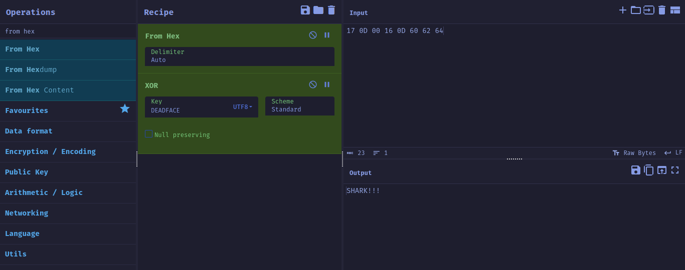

# Cereal Killer 4

## Description

> Points: 200\
> Created by: `TheZeal0t`

lilith is not too old to have a favorite monster / ghoul / daemon / phantasm / poltergeist / creature / extraterrestrial or a favorite sugary breakfast cereal! She also has a favorite programming language (which no one else at DEADFACE likes that much, and they all think she is kinda weird for it). She probably mainly likes it because it was her first language she learned at the age of 9.

See if you can crack her program and figure out what her favorite cereal and entity are.

Enter the answer as flag{LilithLikesMonsterCereal}.

[Download file](./cereal.jar)

## Solution

When the jar file is run, it asks for a password.

```sh
deadface/rev/cereal_killer_4 on  master [!?] via ☕ v21
❯ java -jar cereal.jar
lilith's favorite cereal is also her favorite monster / ghoul / daemon / phantasm / poltergeist / creature / extraterrestrial.
To get both answers (and the flag), enter her entity (with special characters) as a password: asdfasf
Sorry, that is not the correct monster / cereal / password.  Please try again.
```

The jar file is easily decompiled with procyon-decompiler.

```sh
deadface/rev/cereal_killer_4 on  master [!?] via ☕ v21 took 2s
❯ procyon-decompiler cereal.jar > cereal.java
```

Here's the [decompiled](./cereal.java) java file.

The following code snippets are the interesting parts:

```java
class CenoBytes
{
    public static void main(final String[] args) {
        final byte[] kitbal = "b7&q76n=gW3>RT?YXJcPb7*05YXJcPb7*05YXN?K3}_w=6n=hw3>RT?YXJcPb7*056n+5#b7*05YXN?K3}#_+YXJcPb7*05YXJcPb7*f36n+5#b7*05YXJd%3>O{^6n=hweHR{bYXJcPb7*05YXJcPb7*05YkqzKb7*05Ykq!y3>RT?YXJcPb7*05YXJcPb7)}=6afJb3>RT?YXJcP3>O}9Yb$;Za~B>B6ny~!FK8YO6n=gIb7*056n=hwb7*0GYYqVc4;LN{6n+5#4`^X>6n=hw3}<0-H+}&D3>O{^7k&X<3>RT?Ykq!y3>O{^6n=hwFKA(MHvxWr3>O{^WB~yI3>O{^6b@Yhb2J_eYkq!y3>RSy6n=hw3>Q6eYh3|;3}|k0YXJcP4`^X>6n=hwb7)}=6n=hwd}v`V6kP!UFBcwiYXJd$a};4%7XbkQ3>O_PYXMyW4;LPCYkdI$b7x@<6n=dHa};3?YXJccb7)~MYXJd$3};~t6n=dHb7&q77Y+dd3}_uLYkqzK4;OB76n+7H3}|5u6ajq!b7(z%YXN?K3}+n;6n=hwb7&oMHvs`%b7&n76n+5#4-_79YkqzK4`^X7WC0Eib7&oMWB~zvb7x_46ajq!d}v{EYkdI$a~B>CYXMyWa};56YYqVpb3$P*YXMyWb2MRcH-3H&a~B?R7k&-_d>3wVYaam}b97;HWB~yIb2MRcYXN-$a}*v86kP!UFKB6UYaM<cb75f)6nz1Gb7&q76b@Yhb2MQNWB~yIFBBdP6ajq!d}v{EYXJcPa}+&tYXNuxa};iJ6n+7HFKA&dYkdv@b7*01WB~yIa}i;3YXJ!Xb95eTYX|`Wb2MRc7XblXb2MRcYj^<x4`^X*YaanCb2J_eHvs`%3>O{^V}5>q3}|6}7k++zb7*dIYYqVpb7&n66n=hw3>RT?WPN^q3}|6&6n<R+a}*v86n+j}3>O}9YYu&W3>RT?b$)(bb7(yc6n+kV3>O}9Yaf1o3>O{^6afJaFBcvSHvs_&3>O{^YXJ^^3^ZYKH-3Iy3}_t<6n=hP3>RT?WPN^q3>R)L6n=hPb7*c26kP#b3>O|QYXJ@ca};3?YbyZ(b7*05YXJcPb7*05YXJd$d}kgF6n=gVb7)}>6n%aHb7*05YXJcP4`*R=YXJd$d}v{EYXJcPb7*05YXJcPa};iJYXJcP4`*R=YXJcPb7*05YXJcPa};iJYXJcPb7)}>WB~yIb7)}>WB~yIb7&oXYXJcPb7*05YXJd$d}v{EYXJcP4`*R=YXJcPb7*05YXN-@b7*05YXJcPb7&oXYXN=^3};~".getBytes();
        final byte[] amhoamho = "DEADFACE".getBytes();
        final byte[] amho = "7yZuW4pATQ".getBytes();
        final Scanner scanner = new Scanner(System.in);
        System.out.println("lilith's favorite cereal is also her favorite monster / ghoul / daemon / phantasm / poltergeist / creature / extraterrestrial.");
        System.out.print("To get both answers (and the flag), enter her entity (with special characters) as a password: ");
        final String sayongchaAmho = scanner.nextLine().trim();
        final Base85.Z85Decoder zdecoder = new Base85.Z85Decoder();
        final Base85.Rfc1924Decoder decoder = new Base85.Rfc1924Decoder();
        final byte[] amhoDec = zdecoder.decode(amho);
        for (int j = 0; j < amhoDec.length; ++j) {
            final int jdx = j % amhoamho.length;
            final byte[] array = amhoDec;
            final int n = j;
            array[n] ^= amhoamho[jdx];
        }
        final String amhoDecStr = new String(amhoDec, StandardCharsets.UTF_8);
        if (!amhoDecStr.equals(sayongchaAmho)) {
            System.out.println("Sorry, that is not the correct monster / cereal / password.  Please try again.");
            System.exit(0);
        }
        final byte[] kitbalDec = decoder.decode(kitbal);
        for (int i = 0; i < kitbalDec.length; ++i) {
            final int idx = i % amhoDec.length;
            final byte[] array2 = kitbalDec;
            final int n2 = i;
            array2[n2] ^= amhoDec[idx];
        }
        final String kitbalStr = new String(kitbalDec, StandardCharsets.UTF_8);
        System.out.println("If anyone has wisdom, let him / her decompile the Java code and crack the encrypted cereal!");
        System.out.println("Congratulations, Oh Wise One!");
        System.out.println("");
        System.out.println(kitbalStr);
    }
}
```

After reading the java code, it can be seen that our input(`sayongchaAmho`) is checked against `amhoDecStr` which is the UTF_8 decode of `amhoDec`. `amhoDec` is found by the following chain of functions on `amho`: **Xor.Rotate**(**Base85.Z85Decoder**(`amho`), `amhoamho`).

For some reason, the cyberchef's zeroMQ(Z85) Base85 was not working. I might be wrong in how to use it there but got it working in [dcode.fr](https://www.dcode.fr/ascii-85-encoding). Then used xor in cyberchef to get the password.





```sh
deadface/rev/cereal_killer_4 on  master [!?] via ☕ v21
❯ java -jar cereal.jar
lilith's favorite cereal is also her favorite monster / ghoul / daemon / phantasm / poltergeist / creature / extraterrestrial.
To get both answers (and the flag), enter her entity (with special characters) as a password: SHARK!!!
If anyone has wisdom, let him / her decompile the Java code and crack the encrypted cereal!
Congratulations, Oh Wise One!

  _____.__                    ___ ________          __        ___.                .___         _________.__                  __      _____                 __  .__      ___
_/ ____\  | _____     ____   / /  \_____  \   _____/  |_  ____\_ |__   ___________|   | ______/   _____/|  |__ _____ _______|  | __ /     \   ____   _____/  |_|  |__    \ \
\   __\|  | \__  \   / ___\  \ \   /   |   \_/ ___\   __\/  _ \| __ \_/ __ \_  __ \   |/  ___/\_____  \ |  |  \\__  \\_  __ \  |/ //  \ /  \ /  _ \ /    \   __\  |  \   / /
 |  |  |  |__/ __ \_/ /_/  > < <  /    |    \  \___|  | (  <_> ) \_\ \  ___/|  | \/   |\___ \ /        \|   Y  \/ __ \|  | \/    </    Y    (  <_> )   |  \  | |   Y  \  > >
 |__|  |____(____  /\___  /  / /  \_______  /\___  >__|  \____/|___  /\___  >__|  |___/____  >_______  /|___|  (____  /__|  |__|_ \____|__  /\____/|___|  /__| |___|  /  \ \
                 \//_____/   \_\_         \/     \/                \/     \/               \/        \/      \/     \/           \/       \/            \/          \/  _/_/
```

flag: `flag{OctoberIsSharkMonth}`


